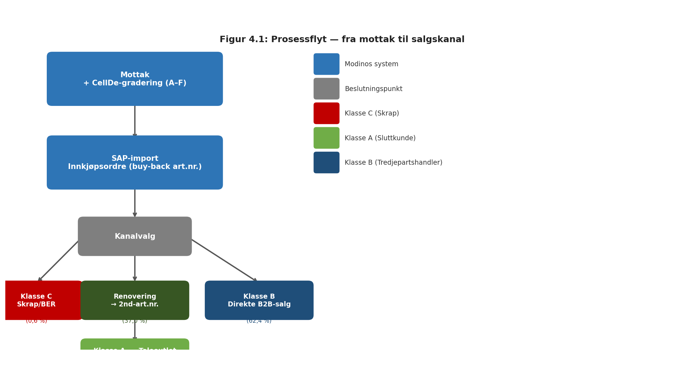
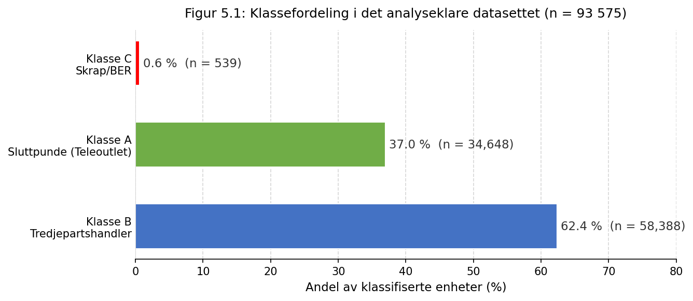
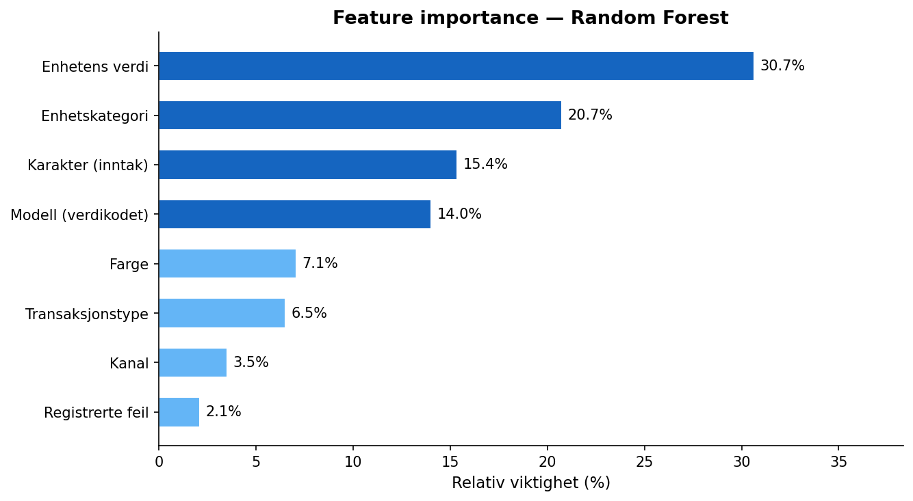
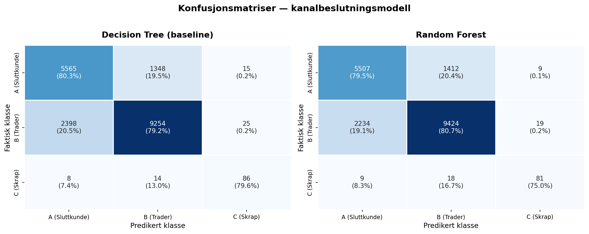

# Tittel (norsk og/eller engelsk)

**Forfatter(e):**

**Totalt antall sider inkludert forsiden:**

**Molde, Innleveringsdato:**

---

## Obligatorisk egenerklæring/gruppeerklæring

Den enkelte student er selv ansvarlig for å sette seg inn i hva som er lovlige hjelpemidler, retningslinjer for bruk av disse og regler om kildebruk. Erklæringen skal bevisstgjøre studentene på deres ansvar og hvilke konsekvenser fusk kan medføre. Manglende erklæring fritar ikke studentene fra sitt ansvar.

Du/dere fyller ut erklæringen ved å klikke i ruten til høyre for den enkelte del 1-6:

**1.** Jeg/vi erklærer herved at min/vår besvarelse er mitt/vårt eget arbeid, og at jeg/vi ikke har brukt andre kilder eller har mottatt annen hjelp enn det som er nevnt i besvarelsen.

**2.** Jeg/vi erklærer videre at denne besvarelsen:

- ikke har vært brukt til annen eksamen ved annen avdeling/universitet/høgskole innenlands eller utenlands.
- ikke refererer til andres arbeid uten at det er oppgitt.
- ikke refererer til eget tidligere arbeid uten at det er oppgitt.
- har alle referansene oppgitt i litteraturlisten.
- ikke er en kopi, duplikat eller avskrift av andres arbeid eller besvarelse.

**3.** Jeg/vi er kjent med at brudd på ovennevnte er å betrakte som fusk og kan medføre annullering av eksamen og utestengelse fra universiteter og høgskoler i Norge, jf. §§4-7 og 4-8 og §§14 og 15.

**4.** Jeg/vi er kjent med at alle innleverte oppgaver kan bli plagiatkontrollert i URKUND.

**5.** Jeg/vi er kjent med at høgskolen vil behandle alle saker hvor det forligger mistanke om fusk etter høgskolens retningslinjer.

**6.** Jeg/vi har satt oss inn i regler og retningslinjer i bruk av kilder og referanser.

---

## Personvern

### Personopplysningsloven

Forskningsprosjekt som innebærer behandling av personopplysninger iht. Personopplysningsloven skal meldes til Norsk senter for forskningsdata, NSD, for vurdering.

**Har oppgaven vært vurdert av NSD?** ja / nei

- Hvis ja – Referansenummer:
- Hvis nei – Jeg/vi erklærer at oppgaven ikke omfattes av Personopplysningsloven:

### Helseforskningsloven

Dersom prosjektet faller inn under Helseforskningsloven, skal det også søkes om forhåndsgodkjenning fra Regionale komiteer for medisinsk og helsefaglig forskningsetikk, REK, i din region.

**Har oppgaven vært til behandling hos REK?** ja / nei

- Hvis ja – Referansenummer:

---

## Publiseringsavtale

**Studiepoeng:**

**Veileder:**

### Fullmakt til elektronisk publisering av oppgaven

Forfatter(ne) har opphavsrett til oppgaven. Det betyr blant annet enerett til å gjøre verket tilgjengelig for allmennheten (Åndsverkloven. §2).

Alle oppgaver som fyller kriteriene vil bli registrert og publisert i Brage HiM med forfatter(ne)s godkjennelse.

Oppgaver som er unntatt offentlighet eller båndlagt vil ikke bli publisert.

**Jeg/vi gir herved Høgskolen i Molde en vederlagsfri rett til å gjøre oppgaven tilgjengelig for elektronisk publisering:** ja / nei

**Er oppgaven båndlagt (konfidensiell)?** ja / nei
(Båndleggingsavtale må fylles ut)

- Hvis ja – Kan oppgaven publiseres når båndleggingsperioden er over? ja / nei

**Dato:**

---

*Antall ord: Marker denne setningen, og skriv inn antall ord dersom det er et krav at antall ord skal oppgis. Hvis det ikke er et krav at antall ord skal oppgis slettes hele dette avsnittet, og i begge tilfeller slettes denne setning.*

*Forfattererklæring: Marker denne setningen, og skriv inn forfattererklæring dersom det er et krav til oppgaven. Hvis det ikke er krav om forfattererklæring slettes hele dette avsnitt, og i begge tilfeller slettes denne setning.*

---

## Sammendrag

Recommerce-markedet for brukte mobilenheter er i vekst, og evnen til å kanalisere innkommende enheter til riktig salgskanal er direkte avgjørende for lønnsomheten. Denne oppgaven undersøker hvordan en AI-basert klassifiseringsmodell kan forbedre kanaliseringsbeslutninger hos Modino AS — en nordisk recommerce-aktør som kjøper, renoverer og videreselger brukte smarttelefoner og nettbrett.

Datagrunnlaget er hentet fra to separate operasjonelle systemer: CellDe (inspeksjon og gradering ved mottak) og SAP S/4HANA (salg og fakturering). Totalt 93 575 enheter fra 2024 og 2025 er analysert. Klassifiseringslogikken bygger på faktisk observert salgskanal — sluttkunde via Teleoutlet (klasse A), tredjepartshandler (klasse B) eller skrap/BER (klasse C) — definert fra SAP-data. En Random Forest-modell er trent på femten features hentet utelukkende fra CellDe på mottakstidspunktet, slik at target leakage unngås.

Modellen oppnår 83,6 % accuracy på testsettet, med F1-score på 0,78 (klasse A), 0,87 (klasse B) og 0,87 (klasse C). Minimumskravet på 80 % er oppfylt med god margin. Den viktigste prediktoren er enhetens estimerte markedsverdi (18,5 %), etterfulgt av enhetskategori (17,0 %) og inntaksgrad (13,7 %). Det dominerende feilmønsteret er forveksling mellom klasse A og B — et delvis strukturelt problem fordi graderingsdata fra CellDe alene ikke fullt ut skiller de to kanalene. Den estimerte lønnsomhetsforbedringen ved modellbasert klassifisering er ~40 000 NOK per år (øvre estimat).

---

## Abstract

Recommerce-markedet for brukte mobilenheter er i rask vekst, og evnen til å kanalisere innkommende enheter til riktig salgskanal er direkte avgjørende for lønnsomheten. Denne oppgaven undersøker hvordan en AI-basert klassifiseringsmodell kan forbedre kanaliseringsbeslutninger hos Modino AS — en nordisk recommerce-aktør som kjøper, renoverer og videreselger brukte smarttelefoner og nettbrett.

Datagrunnlaget stammer fra to separate operasjonelle systemer: CellDe (inspeksjon og gradering ved inntak) og SAP S/4HANA (salg og fakturering). Totalt 93 575 enheter fra 2024 og 2025 er analysert. Målvariabelen er den faktisk observerte salgskanalen — sluttkunde via Teleoutlet (klasse A), tredjepartshandler (klasse B) eller skrap/BER (klasse C) — utledet fra SAP-data. En Random Forest-modell er trent på femten features hentet utelukkende fra CellDe ved mottakstidspunktet, slik at target leakage unngås.

Modellen oppnår 83,6 % nøyaktighet på testsettet, med F1-score på 0,78 (klasse A), 0,87 (klasse B) og 0,87 (klasse C), og oppfyller det definerte minimumskravet med god margin. Den viktigste prediktoren er enhetens estimerte markedsverdi (18,5 %), etterfulgt av enhetskategori (17,0 %) og inntaksgrad (13,7 %). Det dominerende feilmønsteret er forveksling mellom klasse A og B — et delvis strukturelt problem fordi graderingsdata fra CellDe alene ikke fullt ut skiller de to kanalene. Den estimerte lønnsomhetsforbedringen ved modellbasert klassifisering er om lag 40 000 NOK per år (øvre estimat).

---

## Innhold

- [1. Innledning](#1-innledning)
  - [1.1 Problemstilling](#11-problemstilling)
  - [1.2 Delproblemer](#12-delproblemer)
  - [1.3 Avgrensinger](#13-avgrensinger)
  - [1.4 Antagelser](#14-antagelser)
- [2. Litteratur](#2-litteratur)
  - [2.1 Maskinlæring for klassifisering av returnerte forbrukerelektronikk](#21-maskinlæring-for-klassifisering-av-returnerte-forbrukerelektronikk)
  - [2.2 Integrert beslutningsstøtte i reverse logistics](#22-integrert-beslutningsstøtte-i-reverse-logistics)
  - [2.3 Recommerce og sirkulær økonomi for mobilenheter](#23-recommerce-og-sirkulær-økonomi-for-mobilenheter)
  - [2.4 Posisjonering av dette prosjektet](#24-posisjonering-av-dette-prosjektet)
- [3. Teori](#3-teori)
  - [3.1 Sirkulærøkonomi og recommerce](#31-sirkulærøkonomi-og-recommerce)
  - [3.2 Beslutningsstøtte og verdifall](#32-beslutningsstøtte-og-verdifall)
  - [3.3 Maskinlæring og klassifisering](#33-maskinlæring-og-klassifisering)
  - [3.4 Oppsummering og kobling til problemstilling](#34-oppsummering-og-kobling-til-problemstilling)
- [4. Casebeskrivelse](#4-casebeskrivelse)
  - [4.1 Modino AS og recommerce-markedet](#41-modino-as-og-recommerce-markedet)
  - [4.2 Enheter og graderingssystem](#42-enheter-og-graderingssystem)
  - [4.3 Klassifiseringsprosessen — tre kanaler ut av Modino](#43-klassifiseringsprosessen--tre-kanaler-ut-av-modino)
  - [4.4 Datagrunnlaget — to-kilde-arkitektur](#44-datagrunnlaget--to-kilde-arkitektur)
  - [4.5 Klassifiseringsutfordringen](#45-klassifiseringsutfordringen)
- [5. Metode og data](#5-metode-og-data)
  - [5.1 Metode](#51-metode)
  - [5.2 Data](#52-data)
- [6. Modellering](#6-modellering)
  - [6.1 Formalisering av klassifiseringsproblemet](#61-formalisering-av-klassifiseringsproblemet)
  - [6.2 Decision Tree (baseline)](#62-decision-tree-baseline)
  - [6.3 Random Forest (primærmodell)](#63-random-forest-primærmodell)
  - [6.4 Evalueringsrammeverk](#64-evalueringsrammeverk)
- [7. Analyse](#7-analyse)
  - [7.1 Datapreparering og målvariabel](#71-datapreparering-og-målvariabel)
  - [7.2 Observasjoner fra feature-konstruksjonen](#72-observasjoner-fra-feature-konstruksjonen)
  - [7.3 Modelltrening](#73-modelltrening)
  - [7.4 Generaliserbarhet og intern validering](#74-generaliserbarhet-og-intern-validering)
- [8. Resultat](#8-resultat)
  - [8.1 Modellytelse — sammenligning av Decision Tree og Random Forest](#81-modellytelse--sammenligning-av-decision-tree-og-random-forest)
  - [8.2 Konfusjonsmatrise — Random Forest](#82-konfusjonsmatrise--random-forest)
  - [8.3 Feature importance — Random Forest](#83-feature-importance--random-forest)
  - [8.4 Estimert lønnsomhetseffekt (delproblem 2)](#84-estimert-lønnsomhetseffekt-delproblem-2)
- [9. Diskusjon](#9-diskusjon)
  - [9.1 Svar på problemstillingen](#91-svar-på-problemstillingen)
  - [9.2 Sammenligning med litteraturen](#92-sammenligning-med-litteraturen)
  - [9.3 Forretningsmessig betydning for Modino](#93-forretningsmessig-betydning-for-modino)
  - [9.4 Metodiske begrensninger](#94-metodiske-begrensninger)
  - [9.5 Videre forskning](#95-videre-forskning)
- [10. Konklusjon](#10-konklusjon)
- [Bibliografi](#bibliografi)
- [Vedlegg](#vedlegg)

---

## 1. Innledning

Markedet for brukte forbrukerelektronikk er i sterk vekst. Økt bevissthet om ressursbruk, regulatoriske krav til produktlevetid og voksende etterspørsel etter rimeligere alternativer til nye enheter driver en rask ekspansjon av recommerce — kjøp, renovering og videresalg av brukte produkter (Proske et al., 2018). For recommerce-aktører som kjøper inn brukte mobilenheter i stort volum, er evnen til å bestemme hva som skal skje med hver enkelt enhet ved mottak, direkte avgjørende for lønnsomheten. En enhet som sendes til renovering og videresalg til sluttkunde gir vesentlig høyere margin enn en enhet solgt direkte til en B2B-aktør — men renovering er bare lønnsomt dersom enhetens tilstand og markedsverdi gjør det forsvarlig (Ferguson et al., 2009).

Beslutningen om hvilken kanal en innkommende enhet skal til — renovering, direkte B2B-salg eller skrap — må i praksis tas raskt, basert på begrenset informasjon og under tidspress. Guide og Van Wassenhove (2009) dokumenterer at 10 ukers forsinkelse i å få en brukt mobilenhet tilbake på markedet kan tilsvare et tap på omtrent 10 % av enhetens totalverdi. Feil kanalvalg er dermed ikke bare et operasjonelt problem, men et lønnsomhetsproblem med direkte konsekvenser for virksomhetens resultat.

Maskinlæring tilbyr en løsning: ved å trene en klassifiseringsmodell på historiske kanalutfall kan systemet lære hvilke enhetsattributter — tilstandsgrad, estimert markedsverdi, modell, farge — som predikerer hvilken kanal en enhet vil havne i. Ibrahim og Abdul-Kader (2025) demonstrerer at trebaserte klassifiseringsmodeller gir høy nøyaktighet på returdata for mobiltelefoner med tre disponeringskategorier. Turkolmez et al. (2024) finner tilsvarende resultater for refabrikerte laptoper. Govindan et al. (2015) identifiserer datadrevne tilnærminger til operasjonelle graderingsbeslutninger som et anerkjent gap i reverse logistics-litteraturen.

Det som mangler i eksisterende litteratur er en studie som (1) benytter en to-kilde-arkitektur med separate innkjøps- og salgsdata, (2) bruker faktisk observert salgskanal — ikke en lønnsomhetsberegning — som målvariabel, og (3) eksplisitt ekskluderer geografisk salgsinformasjon fra features for å sikre en modell som er anvendbar på beslutningstidspunktet. Dette prosjektet fyller dette gapet gjennom en casestudie hos **Modino AS** — en nordisk recommerce-aktør som kjøper, renoverer og videreselger brukte mobilenheter i Norge, Sverige, Finland og Estland.

Rapporten er strukturert som følger: Kapittel 2 gjennomgår relevant empirisk litteratur. Kapittel 3 presenterer det teoretiske rammeverket. Kapittel 4 beskriver Modino AS og datagrunnlaget. Kapittel 5 redegjør for metode og datapipeline. Kapittel 6 formaliserer og beskriver modellene. Kapittel 7 dokumenterer analysegjennomføringen. Kapittel 8 presenterer resultatene. Kapittel 9 diskuterer funnene. Kapittel 10 konkluderer.

### 1.1 Problemstilling

Hvordan kan en AI-basert klassifiseringsmodell forbedre kanaliseringsbeslutninger for brukte mobilenheter hos Modino AS?

### 1.2 Delproblemer

Problemstillingen operasjonaliseres gjennom to delproblemer:

**Delproblem 1:** I hvilken grad kan en klassifiseringsmodell basert på CellDe-inntaksdata korrekt predikere hvilken salgskanal en brukt mobilenhet vil ende i?

**Delproblem 2:** I hvilken grad kan en mer presis klassifisering øke netto lønnsomhet sammenlignet med historisk kanalvalg?

### 1.3 Avgrensinger

**Produktkategori:** Analysen omfatter utelukkende brukte smarttelefoner og nettbrett håndtert av Modino AS. Andre produktkategorier er ikke inkludert.

**Tidsperiode:** Datagrunnlaget dekker perioden 2024–2025. Konklusjoner om fremtidig ytelse forutsetter at markedsforholdene og Modinos kanalstruktur er tilstrekkelig stabile.

**Beslutningsomfang:** Prosjektet omhandler utelukkende klassifisering av innkommende enheter i tre kanalklasser. Prisingsbeslutninger, lageroptimering og logistikkplanlegging er ikke inkludert.

**Datagrunnlag:** Analysen er basert utelukkende på historiske transaksjonsdata fra Modinos operasjonelle systemer (CellDe og SAP). Det er ikke gjennomført intervjuer, spørreundersøkelser eller innsamling fra andre virksomheter.

**Features:** Kun informasjon tilgjengelig i CellDe på mottakstidspunktet benyttes som input til modellen. SAP-data — inkludert destinasjonsland, salgspris og kostnad — er ekskludert som features.

### 1.4 Antagelser

**Historiske utfall som etiketter:** Det antas at Modinos historisk observerte kanalvalg er konsistente nok til å fungere som treningsetiketter. Modellen lærer av det Modino faktisk har gjort — ikke nødvendigvis det optimale kanalvalget. Konsekvensen er at systematiske historiske feilklassifiseringer potensielt videreføres i modellen, noe som diskuteres i avsnitt 9.4.3.

**Stabile markedsforhold:** Det antas at verdifall, kanalstruktur og graderingslogikk er tilstrekkelig stabile i analyseperioden til at mønstre lært på 2024-data er gyldige på 2025-data og fremover. Endringer i Modinos salgsstruktur — for eksempel nye tredjepartshandlere eller nye geografiske markeder — vil kreve ny modelltrening.

---

## 2. Litteratur

Dette kapittelet gjennomgår de viktigste empiriske bidragene innen maskinlæring i reverse logistics og recommerce, med særlig vekt på forskning fra de siste årene. Målet er å posisjonere denne rapporten i forhold til eksisterende kunnskap og identifisere det gapet som prosjektet søker å fylle.

### 2.1 Maskinlæring for klassifisering av returnerte forbrukerelektronikk

Den empirisk nærmeste studien til dette prosjektet er Ibrahim og Abdul-Kader (2025), som benytter maskinlæring til å klassifisere returnerte mobiltelefoner i tre disponeringskategorier: *refurbishable*, *repairable* og *recyclable* — direkte parallelt med Modinos kanalklasser A, B og C. Studien demonstrerer at trebaserte klassifiseringsmodeller gir høy nøyaktighet på telefondata, og finner at enhetens alder er en av de viktigste prediktorene: telefoner over tre år havner i stor grad i recyclable-kategorien. Studien er særlig verdifull for dette prosjektet fordi den deler produktkategori (mobiltelefoner) og problemstruktur (tre disponeringskategorier), men er gjennomført i en annen forretningskontekst og bygger ikke på en to-kildes dataarkitektur som skiller innkjøp og salg.

Turkolmez et al. (2024) anvender trebaserte maskinlæringsalgoritmer, inkludert Random Forest, på prising og klassifisering av refabrikerte laptoper. Studien viser at disse metodene gir høy nøyaktighet på forbrukerelektronikk-data med varierende tilstandskarakter. Funnet støtter metodevalgene i dette prosjektet, selv om laptoper og mobiltelefoner har ulike verdifallsprofiler og komponentstrukturer, noe som begrenser direkte overførbarhet av konkrete ytelsestall.

Govindan et al. (2015) gjennomgår i en systematisk litteraturstudie av 382 artikler feltet reverse logistics og closed-loop supply chains, og identifiserer datadrevne tilnærminger til operasjonelle graderingsbeslutninger som et anerkjent gap i forskningen. Studien posisjonerer automatisert klassifisering som ett av de mest lovende anvendelsesområdene for data-analyse i reverse supply chains — noe som gir akademisk begrunnelse for relevansen av dette prosjektet.

### 2.2 Integrert beslutningsstøtte i reverse logistics

Hübner et al. (2020) demonstrerer at integrert optimering av innkjøp, gradering og disponering gir vesentlig bedre lønnsomhet enn å behandle disse som isolerte, sekvensielle beslutninger. Studien underbygger at en helhetlig klassifiseringsmodell — som tar hensyn til enhetens tilstand allerede ved mottakstidspunktet — er mer verdifull enn separate manuelle vurderinger i hvert steg. Dette er direkte relevant for Modinos situasjon: klassifiseringsbeslutningen tas ved mottak, men konsekvensene materialiseres i salgskanalen.

Ferguson et al. (2009) viser empirisk at gradering av returnerte produkter *før* reprosessering reduserer totalkostnader med omtrent 11 %. Studien dokumenterer at verdien av gradering øker med variasjonen i returkvalitet og med asymmetrien i feilkostnadene — to kjennetegn som begge er til stede i Modinos operasjon. Det prinsipielle funnet er direkte overførbart, selv om studien er gjennomført i en annen industrikontekst.

### 2.3 Recommerce og sirkulær økonomi for mobilenheter

Proske et al. (2018) analyserer recommerce-markedet for smarttelefoner og dokumenterer at gjenbruk gir betydelig levetidsforlengelse og ressursbesparelse, men at lønnsomheten er sterkt avhengig av korrekt kanalisering av enheter. Studien understreker at feilkanalisering ikke bare er et økonomisk problem for virksomheten, men også reduserer den faktiske miljøgevinsten av recommerce — noe som forankrer prosjektets problemstilling i en bredere sirkulærøkonomisk kontekst.

### 2.4 Posisjonering av dette prosjektet

Den gjennomgåtte litteraturen viser at maskinlæring for klassifisering av returnerte mobilenheter er et empirisk bekreftet anvendelsesområde (Ibrahim & Abdul-Kader, 2025; Turkolmez et al., 2024), og at automatisert gradering har dokumentert lønnsomhetseffekt (Ferguson et al., 2009; Hübner et al., 2020). Det som skiller dette prosjektet fra eksisterende litteratur er kombinasjonen av tre forhold: (1) datagrunnlaget er hentet fra to separate operasjonelle systemer — CellDe for inntak og SAP for salg — og analyseres uten sammenslåing til én fil, (2) klassifiseringen er basert på faktisk observert salgskanal (ikke en lønnsomhetsberegning), og (3) modellen er trent uten tilgang til geografisk informasjon fra salgstidspunktet, noe som representerer et realistisk og praktisk anvendbart beslutningsstøttescenario.

---

## 3. Teori

Dette kapittelet presenterer det teoretiske rammeverket som danner grunnlaget for prosjektets problemstilling, metodevalg og analyse. Kapittelet er strukturert rundt tre faglige pilarer: (1) sirkulærøkonomi og recommerce, (2) beslutningsstøtte og verdifall i reverse logistics, og (3) maskinlæring og klassifisering. Avslutningsvis oppsummeres teoriens kobling til problemstillingen.

Et gjennomgående forbehold er at mye av litteraturen om maskinlæring i reverse logistics er gjennomført i andre industrikontekster enn brukte mobilenheter — for eksempel hvitevarer, bildeler og industrimaskiner. Overførbarheten av konkrete funn må vurderes kritisk opp mot Modinos spesifikke datagrunnlag, og dette adresseres løpende gjennom kapittelet.

---

### 3.1 Sirkulærøkonomi og recommerce

#### 3.1.1 Sirkulærøkonomi

Sirkulærøkonomi er et overordnet rammeverk for ressursbruk som tar sikte på å erstatte den tradisjonelle lineære modellen — produksjon, bruk og kassering — med et system der ressurser holdes i bruk så lenge som mulig. Walter Stahel, som regnes som sirkulærøkonomiens grunnlegger, beskriver overgangen som en bevegelse mot en ytelsesøkonomi der målet er å forlenge produkters levetid gjennom gjenbruk, reparasjon og refabrikasjon (Stahel, 2016). Hans fire mål — produktlivsforlengelse, langtidsbruksvarer, rekondisjonering og avfallsforebygging — er direkte operasjonalisert i Modinos virksomhet.

Geissdoerfer et al. (2017) definerer sirkulærøkonomi som et regenerativt system som søker å minimere ressursinnsats, avfall og energilekkasje ved å bremse, innsnevre og lukke material- og energisløyfer. En kjent svakhet i litteraturen er at begrepet mangler en entydig definisjon: Kirchherr et al. (2017) identifiserte over 100 ulike definisjoner i akademisk litteratur, noe som utfordrer konseptuell klarhet og sammenlignbarhet på tvers av studier.

Et praktisk verktøy for å operasjonalisere sirkulærøkonomiske strategier er **9R-rammeverket**, utviklet av Potting et al. (2017). Rammeverket beskriver ni sirkulære strategier rangert fra mest til minst sirkulær: Refuse, Rethink, Reduce, Reuse, Repair, Refurbish, Remanufacture, Repurpose og Recycle/Recover. Rammeverket er i dag et av de mest brukte verktøyene for å klassifisere og måle sirkulærøkonomiske tiltak internasjonalt. Det er direkte anvendbart på prosjektets klassifiseringssystem:

```
Figur 3.1: Kobling mellom 9R-rammeverket og Modinos salgskanaler

  9R-strategi              Modinos salgskanal
  ─────────────────────────────────────────────────
  R5–R6 – Refurbish /  →   Klasse A: Sluttkunde (Teleoutlet)
           Remanufacture     — enheten renoveres og selges til privatkunde
  R3 – Reuse           →   Klasse B: Tredjepartshandler
                             — enheten selges uten renovering til B2B-aktør
  R8–R9 – Recycle /    →   Klasse C: Skrap
           Recover           — enheten avhendes som skrap/BER

Egenprodusert. Basert på Potting et al. (2017).
```

Ved å forankre klassifiseringssystemet i 9R-rammeverket får modellens predikerte klasser et internasjonalt anerkjent begrepsapparat, og koblingen mellom prosjektet og sirkulærøkonomisk teori blir eksplisitt.

**Kilder:**
Geissdoerfer, M., Savaget, P., Bocken, N. M. P., & Hultink, E. J. (2017). The circular economy – a new sustainability paradigm? *Journal of Cleaner Production*, *143*, 757–768. https://doi.org/10.1016/j.jclepro.2016.12.048

Kirchherr, J., Reike, D., & Hekkert, M. (2017). Conceptualizing the circular economy: An analysis of 114 definitions. *Resources, Conservation and Recycling*, *127*, 221–232. https://doi.org/10.1016/j.resconrec.2017.09.005

Potting, J., Hekkert, M. P., Worrell, E., & Hanemaaijer, A. (2017). *Circular economy: Measuring innovation in the product chain* (PBL-rapport nr. 2544). PBL Netherlands Environmental Assessment Agency.

Stahel, W. R. (2016). The circular economy. *Nature*, *531*(7595), 435–438. https://doi.org/10.1038/531435a

#### 3.1.2 Recommerce og markedet for brukte mobilenheter

Recommerce — kjøp, renovering og videresalg av brukte produkter — er en voksende del av den sirkulære økonomien for forbrukerelektronikk. Proske et al. (2018) analyserer recommerce-markedet for smarttelefoner spesifikt og dokumenterer at gjenbruk av brukte mobilenheter gir betydelig levetidsforlengelse og ressursbesparelse, men at lønnsomheten er sterkt avhengig av at enheter kanaliseres til riktig bruk basert på faktisk tilstand og gjenværende verdi.

En sentral utfordring i recommerce er verdifall over tid. For brukte mobilenheter akselererer verdifallet særlig ved lansering av nye modeller, noe som gjør tidsbruk i feil behandlingskø direkte kostbart (Guide & Van Wassenhove, 2009). En viktig distinksjon i recommerce-litteraturen er mellom *grading* (tilstandsvurdering) og *disposition* (kanalvalg). Galbreth og Blackburn (2006) viser at optimal lønnsomhet forutsetter at gradering skjer tidlig, slik at enheter med lavt potensial sorteres ut før ressurser investeres i testing og reparasjon. Dette er direkte relevant for prosjektets klassifiseringsmodell.

**Kilder:**
Galbreth, M. R., & Blackburn, J. D. (2006). Optimal acquisition and sorting policies for remanufacturing. *Production and Operations Management*, *15*(3), 384–392. https://doi.org/10.1111/j.1937-5956.2006.tb00252.x

Guide, V. D. R., & Van Wassenhove, L. N. (2009). The evolution of closed-loop supply chain research. *Operations Research*, *57*(1), 10–18. https://doi.org/10.1287/opre.1080.0628

Proske, M., Clemm, C., & Scheidt, L. (2018). Does the circular economy grow the pie? The case of rebound effects from smartphone reuse. *Frontiers in Energy Research*, *6*, artikkel 39. https://doi.org/10.3389/fenrg.2018.00039

#### 3.1.3 Reverse logistics

Reverse logistics er prosessene knyttet til tilbakeflyt av produkter fra sluttbruker mot produsent eller mellomledd, med formål om å gjenvinne verdi. Rogers og Tibben-Lembke (1999, s. 2) definerer det som prosessen med planlegging, gjennomføring og kontroll av effektiv og kostnadseffektiv strøm av produkter og informasjon fra forbrukerpunktet tilbake mot opprinnelsespunktet for å gjenvinne verdi eller sikre korrekt disponering. Definisjonen dekker nøyaktig det Modino gjør.

Fleischmann et al. (1997) skiller mellom tre hovedaktiviteter i reverse logistics: innsamling, sortering og redistribusjon. For Modino tilsvarer disse innkjøp av brukte enheter, grading og klassifisering i CellDe, og videresalg gjennom ulike kanaler. Govindan et al. (2015) identifiserer i en systematisk gjennomgang datadrevne tilnærminger til operasjonelle graderingsbeslutninger som et anerkjent gap i litteraturen — noe som direkte posisjonerer Modino-prosjektet som et bidrag til et uløst og relevant forskningsproblem.

**Kilder:**
Fleischmann, M., Bloemhof-Ruwaard, J. M., Dekker, R., van der Laan, E., van Nunen, J. A. E. E., & Van Wassenhove, L. N. (1997). Quantitative models for reverse logistics: A review. *European Journal of Operational Research*, *103*(1), 1–17. https://doi.org/10.1016/S0377-2217(97)00230-0

Govindan, K., Soleimani, H., & Kannan, D. (2015). Reverse logistics and closed-loop supply chain: A comprehensive review to explore the future. *European Journal of Operational Research*, *240*(3), 603–626. https://doi.org/10.1016/j.ejor.2014.07.012

Rogers, D. S., & Tibben-Lembke, R. S. (1999). *Going backwards: Reverse logistics trends and practices*. Reverse Logistics Executive Council.

---

### 3.2 Beslutningsstøtte og verdifall

#### 3.2.1 BER og den økonomiske verdien av gradering

BER (Beyond Economical Repair) beskriver tilstanden der estimerte reparasjonskostnader overstiger enhetens forventede markedsverdi etter reparasjon. En BER-klassifisering innebærer at det er mer lønnsomt å avhende enheten som skrap enn å fullføre reparasjonen (Guide & Van Wassenhove, 2009). I Modinos klassifiseringssystem tilsvarer dette klasse C.

Den mest direkte akademiske begrunnelsen for at nøyaktig gradering har målbar økonomisk verdi, kommer fra Ferguson et al. (2009). I en empirisk studie demonstrerer de at gradering av returnerte produkter *før* reprosessering reduserer totalkostnadene med omtrent 11 % sammenlignet med ingen gradering. Studien viser at verdien av gradering øker med variasjonen i kvalitet på returnerte enheter og med kostnaden per feilklassifisering. Dette er kjerneargumentet som begrunner hele Modino-prosjektet: nøyaktig klassifisering av innkommende enheter har direkte, målbar effekt.

Manuell BER-vurdering er dokumentert som inkonsistent og tidkrevende (Teunter & Flapper, 2011), noe som underbygger behovet for en datadrevet klassifiseringsmodell.

**Kilder:**
Ferguson, M., Guide, V. D. R., Koca, E., & Souza, G. C. (2009). The value of quality grading in remanufacturing. *Production and Operations Management*, *18*(3), 300–314. https://doi.org/10.1111/j.1937-5956.2009.01033.x

Teunter, R. H., & Flapper, S. D. P. (2011). Optimal core acquisition and remanufacturing policies under uncertain core quality fractions. *European Journal of Operational Research*, *210*(2), 241–248. https://doi.org/10.1016/j.ejor.2010.09.024

#### 3.2.2 Verdifall og kapitalbinding

Verdifall er en av de viktigste driverne av lønnsomhet i recommerce. Guide og Van Wassenhove (2009) dokumenterer at for forbrukerelektronikk kan 10 ukers forsinkelse i å få et produkt tilbake på markedet tilsvare et tap på omtrent 10 % av produktets totalverdi — et tap som overstiger de fleste fortjenestemarginer. Dette understreker at rask og presis klassifisering er kritisk.

Geyer et al. (2007) viser at lønnsomheten av refabrikasjon er bestemt av samspillet mellom komponentkvalitet, refabrikasjonskostnad og markedspris — og at ikke alle returnerte enheter bør behandles likt. Dette er det bedriftsøkonomiske grunnlaget for at en klassifiseringsmodell som skiller mellom klasse A, B og C er mer lønnsomt enn en flat behandlingspolicy.

Kapitalbinding oppstår når enheter som burde sorteres ut tidlig i stedet belastes reparasjonskøen. Galbreth og Blackburn (2006) viser formelt at optimal sorteringspolitikk innebærer å sette en minste kvalitetsterskel for hvilke enheter som tas inn i reparasjonsprosessen, og at gevinsten av tidlig sortering øker med hastigheten på verdifallet. Hübner et al. (2020) utdyper dette ved å vise at integrert optimering av innkjøp, gradering og disponering gir vesentlig bedre lønnsomhet enn sekvensielle isolerte beslutninger.

**Kilder:**
Galbreth, M. R., & Blackburn, J. D. (2006). Optimal acquisition and sorting policies for remanufacturing. *Production and Operations Management*, *15*(3), 384–392. https://doi.org/10.1111/j.1937-5956.2006.tb00252.x

Geyer, R., Van Wassenhove, L. N., & Atasu, A. (2007). The economics of remanufacturing under limited component durability and finite product life cycles. *Management Science*, *53*(1), 88–100. https://doi.org/10.1287/mnsc.1060.0600

Hübner, A., Kuhn, H., & Wollenburg, J. (2020). Integrated decision-making in reverse logistics: An optimisation of interacting acquisition, grading and disposition processes. *International Journal of Production Research*, *58*(19), 5786–5805. https://doi.org/10.1080/00207543.2019.1659518

#### 3.2.3 Beslutningsstøttesystemer i logistikk

Beslutningsstøttesystemer (DSS) er informasjonssystemer designet for å støtte semi-strukturerte beslutninger der store datamengder og komplekse avveininger gjør manuell beslutningstaking ineffektiv (Turban et al., 2011). Analytikkbaserte systemer gir størst gevinst når de er tett integrert i eksisterende beslutningsprosesser slik at output omsettes til konkrete handlinger uten ekstra manuelle steg. I dette prosjektet operasjonaliseres dette ved at klassifiseringsmodellens predikerte klasse (A, B eller C) direkte reflekterer den historisk observerte salgskanalen for enheter med tilsvarende egenskaper.

**Kilde:**
Turban, E., Sharda, R., & Delen, D. (2011). *Decision support and business intelligence systems* (9. utg.). Pearson.

---

### 3.3 Maskinlæring og klassifisering

#### 3.3.1 Supervised learning

Maskinlæring er en del av kunstig intelligens der algoritmer lærer mønstre fra data uten at reglene eksplisitt programmeres (Hastie et al., 2009). Innen maskinlæring skilles det mellom supervised learning, unsupervised learning og reinforcement learning. Supervised learning benyttes i dette prosjektet fordi Modinos historiske data inneholder dokumenterte utfall — det er kjent hvilken salgskanal hver enhet faktisk gikk til. Algoritmen lærer å identifisere mønstre mellom input-variabler fra inntak og observert salgskanal, slik at den kan predikere klassen for nye, ukjente enheter (James et al., 2021).

En viktig forutsetning er at historiske utfall er korrekte etiketter på faktisk kanalvalg — og ikke bare et speil av tilfeldig eller inkonsistent praksis. Denne risikoen adresseres i metodekapittelet.

**Kilder:**
Hastie, T., Tibshirani, R., & Friedman, J. (2009). *The elements of statistical learning: Data mining, inference, and prediction* (2. utg.). Springer. https://doi.org/10.1007/978-0-387-84858-7

James, G., Witten, D., Hastie, T., & Tibshirani, R. (2021). *An introduction to statistical learning with applications in R* (2. utg.). Springer. https://doi.org/10.1007/978-1-0716-1418-1

#### 3.3.2 Feature engineering og klasseimbalanse

Feature engineering er prosessen med å velge, transformere og konstruere input-variabler for å maksimere modellens prediktive kraft (Zheng & Casari, 2018). For dette prosjektet inkluderer sentrale features enhetens tilstandsgrad ved mottak, estimert innkjøpsverdi, enhetsmodell, -kategori, -farge, transaksjonstype og kanal — alle hentet fra CellDe-systemet på mottakstidspunktet. Et gjennomgående designprinsipp er at kun informasjon som er tilgjengelig *ved mottak* kan brukes som feature, for å unngå target leakage.

En praktisk utfordring er klasseimbalanse: klasse C (skrap) utgjør kun 0,6 % av det klassifiserte datasettet. Chawla et al. (2002) introduserte SMOTE (Synthetic Minority Over-sampling Technique) som én løsning, men i dette prosjektet benyttes klassevekting via `class_weight='balanced'` i scikit-learn, som justerer vekten på hver observasjon omvendt proporsjonalt med klassens frekvens uten å generere syntetiske datapunkter.

**Kilder:**
Chawla, N. V., Bowyer, K. W., Hall, L. O., & Kegelmeyer, W. P. (2002). SMOTE: Synthetic minority over-sampling technique. *Journal of Artificial Intelligence Research*, *16*, 321–357. https://doi.org/10.1613/jair.953

Zheng, A., & Casari, A. (2018). *Feature engineering for machine learning*. O'Reilly Media.

#### 3.3.3 Klassifiseringsalgoritmer

Klassifisering er en type supervised learning der målet er å predikere hvilken kategori en observasjon tilhører (Hastie et al., 2009). I dette prosjektet er problemet et multiclass classification-problem med tre klasser (A, B og C).

**Decision Tree** (Quinlan, 1986) benyttes som basismodell. Den er enkel og tolkbar, men utsatt for overfitting.

**Random Forest** (Breiman, 2001) er primærkandidaten. Metoden bygger et stort antall decision trees på tilfeldige underutvalg av data og variabler, og kombinerer prediksjonene gjennom majoritetsstemme. Metoden er robust mot overfitting, håndterer kategoriske variabler og klasseimbalanse godt, og produserer feature importance-verdier som angir hvilke enhetsattributter som driver kanalklassen. Ibrahim og Abdul-Kader (2025) og Turkolmez et al. (2024) demonstrerer begge at trebaserte metoder gir høy nøyaktighet på klassifisering av returnert forbrukerelektronikk, noe som støtter dette valget empirisk. Rekdal og Pettersen (2026, kap. 9) viser i tillegg at CART-beslutningstrær for disposisjonsbeslutninger i returlogistikk gir 92,4 % treff mot optimale etiketter — en direkte parallell til dette prosjektets problemstruktur.

**Kilder:**
Breiman, L. (2001). Random forests. *Machine Learning*, *45*(1), 5–32. https://doi.org/10.1023/A:1010933404324

Quinlan, J. R. (1986). Induction of decision trees. *Machine Learning*, *1*(1), 81–106. https://doi.org/10.1007/BF00116251

#### 3.3.4 Evalueringsmetrikker

For å vurdere modellens ytelse benyttes standard klassifiseringsmetrikker (Sokolova & Lapalme, 2009):

**Accuracy** angir andelen korrekte prediksjoner totalt. Accuracy kan gi et misvisende bilde ved sterk klasseimbalanse og suppleres derfor alltid av precision og recall.

**Precision per klasse** angir andelen av de enhetene som ble predikert til klasse X som faktisk tilhørte klasse X.

**Recall per klasse** angir andelen av enhetene som faktisk tilhørte klasse X som modellen korrekt identifiserte.

**F1-score** er det harmoniske gjennomsnittet av precision og recall, og gir ett samlet mål per klasse.

**Confusion matrix** visualiserer fordelingen av korrekte og feilaktige prediksjoner for alle klasser og er nyttig for å identifisere systematiske feilklassifiseringer (Fawcett, 2006).

**Kilder:**
Fawcett, T. (2006). An introduction to ROC analysis. *Pattern Recognition Letters*, *27*(8), 861–874. https://doi.org/10.1016/j.patrec.2005.10.010

Sokolova, M., & Lapalme, G. (2009). A systematic analysis of performance measures for classification tasks. *Information Processing & Management*, *45*(4), 427–437. https://doi.org/10.1016/j.ipm.2009.03.002

---

### 3.4 Oppsummering og kobling til problemstilling

```
Figur 3.2: Teorirammeverkets tre pilarer og kobling til prosjektets røde tråd

  PILAR 1                    PILAR 2                    PILAR 3
  Sirkulærøkonomi      →     Verdifall &          →     Maskinlæring &
  & Recommerce               BER-beslutning              Klassifisering
  ─────────────────          ─────────────────           ─────────────────
  Stahel (2016)              Ferguson et al.             Breiman (2001)
  Potting et al. (2017)      (2009)                      James et al. (2021)
  Geissdoerfer et al.        Geyer et al. (2007)         Ibrahim &
  (2017)                     Galbreth &                  Abdul-Kader (2025)
  Proske et al. (2018)       Blackburn (2006)            Turkolmez et al.
                             Hübner et al. (2020)        (2024)
        │                          │                           │
        └──────────────────────────┴───────────────────────────┘
                                   │
                      ┌────────────▼────────────┐
                      │  INNTAK (CellDe-data)   │
                      │  → PREDIKSJON (RF)      │
                      │  → SALGSKANAL A/B/C     │
                      └─────────────────────────┘

Egenprodusert.
```

Sirkulærøkonomi-litteraturen (Stahel, 2016; Potting et al., 2017; Geissdoerfer et al., 2017) gir den strategiske begrunnelsen for Modinos virksomhet og forankrer klassifiseringssystemet A/B/C i 9R-rammeverket. Reverse logistics-teorien (Galbreth & Blackburn, 2006; Ferguson et al., 2009; Hübner et al., 2020) definerer det operasjonelle beslutningsproblemet og dokumenterer at nøyaktig gradering har direkte, målbar effekt — noe Ferguson et al. (2009) beviser empirisk med ~11 % kostnadsreduksjon. Maskinlæringslitteraturen (Breiman, 2001; James et al., 2021; Ibrahim & Abdul-Kader, 2025) gir det metodiske verktøyet og den empiriske begrunnelsen for at trebaserte klassifiseringsmodeller er egnet for nettopp denne typen problem.

---

## 4. Casebeskrivelse

### 4.1 Modino AS og recommerce-markedet

Modino AS er en nordisk recommerce-aktør med virksomhet i Norge, Sverige, Finland og Estland (basert på prosjektinformasjon fra Modino AS). Selskapet kjøper brukte mobilenheter fra mobiloperatører, forsikringsselskaper og privatpersoner, og videreseller dem enten direkte til profesjonelle kjøpere (B2B) eller etter renovering til sluttkunder via sin netthandelsplattform Teleoutlet (One2cel AS). Modino opererer dermed i skjæringspunktet mellom reverse logistics og recommerce, og håndterer hele kjeden fra innkjøp og gradering til reparasjon og distribusjon.

Markedet for brukte mobilenheter er i vekst og drives av økt bevissthet om ressursbruk, regulatoriske krav til produktlevetid og voksende etterspørsel etter rimelige alternativer til nye enheter (Proske et al., 2018). Recommerce skiller seg fra tradisjonell lineær handel ved at produktets verdi ikke avskrives fullt ut ved første salg — gjenværende bruksverdi kan realiseres gjennom renovering og videresalg. For Modino er evnen til å identifisere hvilken kanal en enhet passer best for, direkte avgjørende for lønnsomheten i hvert enkelt produkt.

### 4.2 Enheter og graderingssystem

Modinos sortiment består utelukkende av brukte smarttelefoner og nettbrett. Enhetene ankommer i varierende tilstand — fra tilnærmet nye enheter med kosmetiske skjønnhetsfeil til enheter med alvorlige funksjonsfeil eller strukturelle skader.

Ved mottak gjennomgår hver enhet en automatisert inspeksjon i **CellDe** — Modinos digitale inspeksjons- og graderingsverktøy. CellDe tester enhetens funksjoner (skjerm, batteri, kamera, tilkobling m.m.) og registrerer eventuelle feil. På bakgrunn av denne inspeksjonen tildeles enheten en **inntaksgrad** på skalaen A–F, der A representerer best tilstand og F representerer enhet med alvorlige feil som gjør reparasjon ulønnsom:

**Tabell 4.1: CellDe-graderingsskala**

| Grad | Beskrivelse |
|---|---|
| A | Tilnærmet som ny — ingen eller minimale kosmetiske feil |
| B | Lettere slitasje — mindre riper, fullt funksjonell |
| C | Merkbar slitasje — synlige riper eller skader, funksjoner intakte |
| D | Betydelig slitasje eller enkeltfeil som krever reparasjon |
| E | Alvorlige feil — krever omfattende reparasjon |
| F | BER-kandidat — reparasjon ikke lønnsomt |

Inntaksgraden er den primære informasjonen om enhetens tilstand på det tidspunktet en kanaliseringsbeslutning må tas. Den registreres alltid, og er tilgjengelig for alle enheter i datasettet. CellDe registrerer i tillegg enhetens estimerte markedsverdi (`Inspected Device Value`), enhetsmodell, farge, enhetskategori, transaksjonstype og kanal — informasjon som alle er tilgjengelig ved mottakstidspunktet.

### 4.3 Klassifiseringsprosessen — tre kanaler ut av Modino

Etter inntak og CellDe-gradering importeres enhetens data til Modinos ERP-system, **SAP S/4HANA**. SAP oppretter en innkjøpsordre (Purchase Order) for enheten med et *buy-back*-artikkelnummer på formen `nummer_variant_grad` (for eksempel `16854_2_0`). Dette artikkelnummeret identifiserer enheten i SAP frem til den eventuelt gjennomgår renovering.

Fra dette punktet kan enheten ta én av tre veier ut av Modino:

**Kanal A — Sluttkunde via Teleoutlet (renovering)**
Enheten sendes til renovering gjennom en underleverandørordre (Subcontracting PO). Etter vellykket renovering endres artikkelnummeret fra buy-back-format til et *2nd*-artikkelnummer (rent numerisk, for eksempel `47731`). Den nye artikkelbeskrivelsen i SAP (`maktx`) koder eksplisitt inn post-renoverings-graden: en beskrivelse som `2nd-C iPhone 13 128GB Midnight` angir at enheten er gradert C etter renovering. Enheten selges deretter til privatkunder gjennom One2cel AS / Teleoutlet. Denne kanalen representerer 37,0 % av klassifiserte enheter i datasettet.

**Kanal B — Tredjepartshandler (direkte salg)**
Enheten selges uten renovering til en profesjonell B2B-aktør (tredjepartshandler) ved hjelp av det opprinnelige buy-back-artikkelnummeret. Selskapet faktureres direkte, og enheten forlater Modino uten ytterligere behandling. Kjente tredjepartshandlere i datasettet inkluderer Foxway OÜ, Bridge Nine OÜ, Renewed AB og Care1 A/S, identifisert via numerisk kunde-ID (`kunag`). Denne kanalen er den dominerende og representerer 62,4 % av klassifiserte enheter.

**Kanal C — Skrap/BER**
Enheten er vurdert som Beyond Economical Repair — reparasjonskostnadene overstiger forventet markedsverdi etter renovering. Enheten selges som skrap til kunde `1365865` («Modino vareuttak»), alltid med buy-back-artikkelnummer. BER-enheter gjennomgår aldri renovering og tildeles aldri et 2nd-artikkelnummer. Denne kanalen utgjør 0,6 % av klassifiserte enheter — en sterk klasseimbalanse som adresseres metodisk i kapittel 5.

Figur 4.1 illustrerer den fullstendige prosessflyten fra mottak til salgskanal.



*Figur 4.1: Prosessflyt — fra inntak og CellDe-gradering til de tre salgskanaler A, B og C. Egenprodusert.*

Forholdet mellom artikkelnummertype og salgskanal er oppsummert i tabell 4.2.

**Tabell 4.2: Artikkelnummertype og salgskanal**

| Artikkelnummertype | Format | Eksempel | Salgskanal |
|---|---|---|---|
| Buy-back | `nummer_variant_grad` | `16854_2_0` | Tredjepartshandler eller Skrap/BER |
| 2nd | Rent numerisk | `47731` | Sluttkunde (Teleoutlet) |

### 4.4 Datagrunnlaget — to-kilde-arkitektur

Modinos operasjon genererer data i to separate systemer, og disse utgjør prosjektets to kildefiler:

**CellDe-filen** (`InspectedDeviceREport_cleaned_anon.xlsx`) representerer enhetens tilstand *ved inntak*. Filen inneholder én rad per inspeksjon og dekker 103 400 unike enheter fordelt på 2024 (45 676 rader) og 2025 (57 867 rader). Nøkkelfeltet er `IMEI` (15-sifret tekststreng), og relevante kolonner er blant annet `Grade`, `Inspected Device Value`, `Device Model`, `Device Category`, `Inspection Color`, `Transaction Type`, `Channel` og `InspectedFaults`.

**SAP-filen** (`Z_BBTI_IMEI_TRACK_cleaned_anon.xlsx`) representerer enhetens *utgang* — hvilken kanal den faktisk gikk til, til hvilken pris og med hvilken kostnad. Filen inneholder én rad per unike IMEI og dekker 93 580 enheter. Nøkkelfeltet er `imei`, og relevante kolonner inkluderer `kunag` (selge-til kunde-ID), `kunnr` (sende-til kunde-ID), `matnr` (artikkelnummer) og `maktx` (artikkelbeskrivelse).

De to filene kobles utelukkende i minnet under analyse, via IMEI som koblingsnøkkel. De lagres aldri som én sammenslått fil. Av 103 400 CellDe-registrerte enheter har 93 580 (90,5 %) en tilsvarende SAP-rad — de resterende 9 820 antas å være i lager, under renovering eller avskrevet. Tabellen under oppsummerer datagrunnlaget.

**Tabell 4.3: Datagrunnlag**

| Fil | Kilde | Periode | Rader | Unike IMEI |
|---|---|---|---|---|
| `InspectedDeviceREport_cleaned_anon.xlsx` | CellDe | 2024–2025 | 103 543 (rådata) | 103 400 |
| `Z_BBTI_IMEI_TRACK_cleaned_anon.xlsx` | SAP S/4HANA | 2024–2025 | 93 580 | 93 580 |
| Koblet datasett (i minnet) | CellDe + SAP | 2024–2025 | 93 575 | 93 575 |

*Merk: 93 575 rader etter frafall av 5 uklassifiserte enheter og 11 rader med manglende verdier i features.*

### 4.5 Klassifiseringsutfordringen

Kanalvalget for en enhet bestemmes i prinsippet av enhetens verdi og tilstand — og bør ideelt sett kunne predikeres fra CellDe-data som foreligger ved mottak. I praksis viser analysen at `ship_country` fra SAP korrelerer nær perfekt med kanalklassen: enheter i kanal A (sluttkunde/Teleoutlet) sendes i 98,5 % av tilfellene til Norge, mens enheter i kanal B (tredjepartshandler) i nærmere 100 % av tilfellene sendes til andre land — primært Estland. Denne korrelasjonen reflekterer imidlertid ikke en årsaksrelasjon fra geografi til kanal, men den motsatte: kanalen bestemmer destinasjonen. Kanal A er Modinos norske sluttkunder via Teleoutlet; kanal B er europeiske B2B-kjøpere. Norge og Estland er navn på disse kjøpergruppene — ikke forklaringer på kanalvalget.

Dette representerer likevel en fundamental metodisk begrensning: `ship_country` registreres kun *etter* at salget er gjennomført og er dermed utilgjengelig som feature på beslutningstidspunktet (target leakage). CellDe-systemet registrerer ingen informasjon om hvem enheten skal selges til — de samme innleveringsbutikkene (for eksempel Telenor-butikker) leverer enheter som ender i begge kanaler, avhengig av markedssituasjon og lagerstyring.

Konsekvensen er at modellen må ta kanaliseringsbeslutningen uten tilgang til den informasjonen som i ettertid skiller A fra B mest konsekvent. Dette forklarer en strukturell begrensning i modellnøyaktigheten for A/B-skillet, og diskuteres nærmere i kapittel 9. Det metodisk riktige valget er likevel å ekskludere destinasjonsinformasjon fra modellen, da en modell basert på post-salgsdata ikke ville vært anvendbar i en faktisk driftssetting.

---

## 5. Metode og data

### 5.1 Metode

#### 5.1.1 Forskningsdesign

Prosjektet er utformet som en kvantitativ casestudie (Yin, 2018). Datagrunnlaget er historiske transaksjonsdata fra Modinos operasjonelle systemer, og analysen er gjennomført på et ferdig avgrenset datasett uten innsamling gjennom intervju eller spørreskjema. Den vitenskapelige tilnærmingen er positivistisk: det antas at observerte mønstre i historiske utfall er systematiske og stabile nok til at en modell trent på dem kan generalisere til fremtidige enheter (James et al., 2021).

Problemstillingen er prediktiv — målet er ikke å forklare *hvorfor* enheter havner i ulike kanaler, men å predikere *hvilken* kanal en enhet med gitte egenskaper vil ende i. Dette skiller prosjektet fra en tradisjonell forklarende studie og motiverer valget av maskinlæring fremfor regresjonsanalyse.

**Kilde:**
Yin, R. K. (2018). *Case study research and applications: Design and methods* (6. utg.). Sage.

#### 5.1.2 Valg av metode

Supervised learning klassifisering er valgt fordi Modinos historiske data inneholder dokumenterte utfall: det er kjent hvilken salgskanal hver enhet faktisk gikk til. Dette gir grunnlag for en etikettert treningsdataset, som er en forutsetning for supervised learning (Hastie et al., 2009).

Alternativet — en optimaliseringsmodell (for eksempel lineær programmering) — ble vurdert og forkastet. En optimaliseringsmodell krever en eksplisitt målfunksjon, beslutningsvariabler og restriksjoner, og forutsetter at kanalenes relative lønnsomhet er kjent og stabil. Klassifisering er metodisk enklere å begrunne og gjennomføre innenfor prosjektets rammer, og gir en direkte operasjonell output — predikert kanal — som kan integreres i Modinos eksisterende arbeidsflyt.

**Decision Tree** (Quinlan, 1986) benyttes som basismodell (baseline) fordi den er transparent og enkelt tolkbar. **Random Forest** (Breiman, 2001) er primærmodellen, valgt for sin robusthet mot overfitting, evne til å håndtere klasseubalanse og produksjon av feature importance-verdier.

Analysene er gjennomført i **Python 3** med bibliotekene `pandas` (databehandling), `scikit-learn` (modellering) og `openpyxl` (Excel-innlasting).

### 5.2 Data

#### 5.2.1 Datakilder og innlasting

Datagrunnlaget er hentet direkte fra Modinos operasjonelle systemer og stilt til rådighet for prosjektet i anonymisert form. Dataperioden er 2024–2025. Filene er i Excel-format (.xlsx) og leses inn separat:

CellDe-filen inneholder to regneark — ett per år — som konkatenteres til ett samlet datasett. Duplikater på IMEI-nivå fjernes ved å beholde den første forekomsten:

```python
cd24 = pd.read_excel(cellde_path, sheet_name='2024', dtype={'IMEI': str})
cd25 = pd.read_excel(cellde_path, sheet_name='2025', dtype={'IMEI': str})
cellde = pd.concat([cd24, cd25], ignore_index=True).drop_duplicates(subset='IMEI', keep='first')
```

SAP-filen leses inn med `kunag` og `kunnr` som tekststrenger for å bevare ledende nuller i kunde-ID:

```python
sap = pd.read_excel(sap_path, sheet_name='Sheet1',
                    dtype={'imei': str, 'kunag': str, 'kunnr': str})
```

De to filene kobles deretter i minnet via en venstrejoin på IMEI. Filene lagres aldri sammenslått — sammenslåingen eksisterer kun i arbeidsminnet under analysen. Av 103 400 CellDe-enheter har 93 580 (90,5 %) en tilsvarende SAP-rad. Etter sammenkobling og frafall av rader med manglende feature-verdier utgjør det analyseklare datasettet 93 575 rader.

#### 5.2.2 Datakvalitet og rensing

Begge kildefiler er levert i forhåndsrenset form. Rensingen som er gjennomført på rådata inkluderer:

- Fjerning av rader med blankt IMEI
- Fjerning av rader med ugyldig IMEI (ikke nøyaktig 15 sifre)
- Fjerning av dummy-IMEI `101010101010101` (oppsto 478 ganger totalt)
- IMEI lagret som 15-sifret tekststreng (eliminerer problemer med vitenskapelig notasjon fra Excel)
- For SAP-filen: fjerning av 864 duplikate IMEI-rader (samme enhet fakturert flere ganger samme dato); deduplisering beholder tidligste fakturadato per IMEI

Dataene er anonymisert av Modino: kundenavn er fjernet, og alle identifikatorer er numeriske kunde-IDer. I prosjektet benyttes utelukkende `kunnr` (numerisk sende-til kunde-ID) og `kunag` (numerisk selge-til kunde-ID) for klassifisering — ikke kundenavn, som er upålitelig som følge av tegnsettproblem i kildesystemet.

#### 5.2.3 Klassifisering — definisjon av målvariabelen

Målvariabelen `klasse` defineres på bakgrunn av SAP-data og angir hvilken salgskanal enheten faktisk gikk til. Klassifiseringen gjennomføres i tre trinn som sjekkes i fast prioritetsrekkefølge:

**Trinn 1 — Klasse C (Skrap/BER):** Enheten er klassifisert som skrap dersom `kunnr == '1365865'`. Denne kunden («Modino vareuttak») er mottaker for alle BER-enheter. Sjekken utføres alltid først for å forhindre feilklassifisering dersom en BER-enhet skulle sammenfalle med andre betingelser.

**Trinn 2 — Klasse A (Sluttkunde):** Enheten er klassifisert som sluttkunde-salg dersom `matnr` er rent numerisk (regulært uttrykk: `^\d+$`). Et rent numerisk artikkelnummer identifiserer et 2nd-artikkel, som per Modinos prosess utelukkende brukes for enheter som har gjennomgått renovering og selges via Teleoutlet.

**Trinn 3 — Klasse B (Tredjepartshandler):** Enheten er klassifisert som B2B-salg dersom `kunag` tilhører den kjente trader-mengden. Trader-IDene er numeriske kunde-IDer identifisert fra SAP:

```python
traders = {'544127', '707086', '995702', '498232', '1533558', '1536986',
            '1550704', '715038', '1530444', '1530472', '1602135', '1602088'}
```

Enheter som ikke tilfredsstiller noen av de tre betingelsene (5 rader) ekskluderes fra analysen. Klassifiseringsresultatet er oppsummert i tabell 5.1.

**Tabell 5.1: Klassifiseringsresultat**

| Klasse | Kanal | Antall | Andel |
|---|---|---|---|
| A | Sluttkunde (Teleoutlet) | 34 648 | 37,0 % |
| B | Tredjepartshandler | 58 388 | 62,4 % |
| C | Skrap/BER | 539 | 0,6 % |
| Uklassifisert (ekskludert) | — | 5 | < 0,1 % |
| **Totalt** | | **93 580** | **100 %** |

Den sterke dominansen til klasse B og den svært lave andelen til klasse C er tydelig illustrert i figur 5.1.



*Figur 5.1: Klassefordeling i det analyseklare datasettet (n = 93 575). Klasse B (tredjepartshandler) dominerer med 62,4 %, mens klasse C (skrap/BER) utgjør kun 0,6 %. Egenprodusert.*

#### 5.2.4 Feature engineering

Et gjennomgående designprinsipp er at kun informasjon som er tilgjengelig i CellDe *ved mottakstidspunktet* kan benyttes som feature. SAP-data (pris, kostnad, artikkelnummer, destinasjonsland) tilhører salgstidspunktet og er utilgjengelig på beslutningstidspunktet — bruk av slike variabler ville innebære target leakage og gi en modell uten praktisk anvendbarhet.

Femten features er konstruert fra CellDe-data:

**`grade_num`** — Inntaksgraden konverteres til en ordinal numerisk variabel: A=6, B=5, C=4, D=3, E=2, F=1. Ordinal koding bevarer den rangmessige relasjonen mellom graderingstrinnene.

**`device_value`** — `Inspected Device Value` er lagret i norsk tallformat med komma som desimalskilletegn og mellomrom som tusenskille (for eksempel `'3 954,04'`). Verdien parses til float med følgende funksjon:

```python
def parse_no_number(s):
    if pd.isna(s): return np.nan
    s = str(s).strip().replace('\xa0', '').replace(' ', '').replace(',', '.')
    try: return float(s)
    except: return np.nan
```

**`model_encoded`** — `Device Model` inneholder 557 unike modellnavn. For å ivareta all modellinformasjon uten å introdusere svært høy dimensjonalitet, kodes hver modell med medianverdien av `device_value` for alle enheter av den modellen. Dette gir en kontinuerlig variabel som rangerer modeller etter typisk markedsverdi.

**`color_group_enc`** — `Inspection Color` inneholder 246 ulike fargenavn. Fargene grupperes i ti semantiske grupper — Black, White/Silver, Gray, Blue, Gold, Green, Purple/Violet, Red/Pink, Yellow og Other — og kodes deretter med label encoding (0–9).

**`Transaction Type_enc`** — 21 kategorier label-kodet (0–20).

**`Channel_enc`** — 20 kategorier label-kodet (0–19).

**`Device Category_enc`** — 3 kategorier (for eksempel smarttelefon, nettbrett) label-kodet (0–2).

**`har_feil`** — Binær variabel: 1 dersom `InspectedFaults` inneholder registrerte feil, 0 ellers.

**`fault_count`** — Antall individuelle feil registrert i `InspectedFaults`, telt som antall kommaseparerte elementer. Erstatter den binære `har_feil` med en mer granulær representasjon av skadeomfanget.

**`storage_gb`** — Lagringskapasitet i GB, ekstrahert fra modellnavnet med regulært uttrykk (`\d+ GB`). Enheter med høy lagringskapasitet er gjennomgående mer verdifulle og har høyere sannsynlighet for klasse A.

**`inspect_month`** — Måneden innleveringen ble gjennomført (1–12), avledet fra `Inspected Date`. Fanger opp sesongmessige variasjoner i enhetsmiks og markedsverdi.

**`inspect_year`** — Innleveringsår (2024 eller 2025). Reflekterer generelt verdiskift over tid ettersom nye modellgenerasjoner introduseres.

**`brand_enc`** — Merkevarenavn (Apple, Samsung, Google m.fl.) ekstrahert fra første ord i `Device Model` og label-kodet. Fanger opp merkespesifikke verdiprofiler som ikke fullt ut er ivaretatt av `model_encoded`.

**`dealer_A_rate`** — Historisk andel klasse A-enheter per leverandør (`DealerId`), beregnet utelukkende på treningssettet og deretter anvendt på testsettet (target encoding). Fanger opp at ulike leverandørkanaler systematisk leverer enheter av ulik kvalitet.

**`dealer_B_rate`** — Tilsvarende historisk andel klasse B-enheter per leverandør.

Det bemerkes at label encoding for `Transaction Type`, `Channel` og `Device Category` teknisk sett impliserer en ordinal relasjon mellom kategorier som ikke nødvendigvis eksisterer. For trebaserte metoder (Decision Tree og Random Forest) har dette i praksis begrenset betydning, ettersom splittepunktvalget ikke forutsetter noen lineær avstandsrelasjon mellom koder. Bruken av label encoding for uordnede kategorier i trebaserte modeller er et kjent og akseptert forenklingsvalg i litteraturen (Zheng & Casari, 2018), men begrensningen dokumenteres i diskusjonskapittelet.

Alle 15 features er oppsummert i tabell 5.2.

**Tabell 5.2: Feature-oversikt**

| Feature | Kilde (CellDe-kolonne) | Transformasjon |
|---|---|---|
| `grade_num` | `Grade` | Ordinal: A=6 … F=1 |
| `device_value` | `Inspected Device Value` | Norsk format → float |
| `model_encoded` | `Device Model` | Median `device_value` per modell |
| `color_group_enc` | `Inspection Color` | 246 farger → 10 grupper → label encoding |
| `Transaction Type_enc` | `Transaction Type` | 21 kategorier → label encoding |
| `Channel_enc` | `Channel` | 20 kategorier → label encoding |
| `Device Category_enc` | `Device Category` | 3 kategorier → label encoding |
| `har_feil` | `InspectedFaults` | Binær (1 = feil registrert) |
| `fault_count` | `InspectedFaults` | Antall kommaseparerte feil (0–N) |
| `storage_gb` | `Device Model` | GB-verdi ekstrahert med regex |
| `inspect_month` | `Inspected Date` | Måned (1–12) |
| `inspect_year` | `Inspected Date` | År (2024/2025) |
| `brand_enc` | `Device Model` | Merke label-kodet |
| `dealer_A_rate` | `DealerId` | Historisk A-andel per leverandør (target encoding, treningssett) |
| `dealer_B_rate` | `DealerId` | Historisk B-andel per leverandør (target encoding, treningssett) |

#### 5.2.5 Train/test-split og håndtering av klasseimbalanse

Datasettet deles i et treningssett (80 %) og et testsett (20 %) med stratifisert sampling (`stratify=y`). Stratifisering sikrer at klassenes relative fordeling er lik i begge sett — særlig viktig for klasse C som kun utgjør 0,6 % av dataene. Det stratifiserte splittet gir:

- Treningssett: 74 953 rader (A: 27 744 / B: 46 776 / C: 436)
- Testsett: 18 739 rader (A: 6 936 / B: 11 694 / C: 109)

Klasseimbalansen (C utgjør 0,6 %) håndteres ved `class_weight='balanced'` i scikit-learn. Dette justerer hver enkelt observasjons vekt omvendt proporsjonalt med klassens frekvens under trening, uten å generere syntetiske datapunkter. SMOTE (Chawla et al., 2002) ble vurdert som alternativ men forkastet da `class_weight='balanced'` er enklere å implementere, ikke introduserer risiko for overfitting på syntetiske punkter, og gir sammenlignbare resultater i litteraturen.

---

## 6. Modellering

### 6.1 Formalisering av klassifiseringsproblemet

La hver enhet *i* representeres ved en feature-vektor **x**_i ∈ ℝ¹⁵, der de femten elementene tilsvarer de CellDe-baserte variablene beskrevet i avsnitt 5.2.4. Målvariabelen *y*_i ∈ {A, B, C} angir den observerte salgskanalen. Klassifiseringsproblemet er å lære en funksjon

```
f : ℝ¹⁵ → {A, B, C}
```

slik at *f*(**x**_i) ≈ *y*_i for treningsdataene, og at *f* generaliserer til nye, ukjente enheter. Problemet er et multiclass classification-problem (tre klasser) innen supervised learning (James et al., 2021).

Rekdal og Pettersen (2026, kap. 9) beskriver en strukturelt analog problemstilling — disposisjonsbeslutning for returnerte enheter — der samme trebaserte tilnærming benyttes for å velge mellom reparere, refurbishe, resirkulere og deponere. Denne parallellen støtter valget av metodikk i dette prosjektet.

### 6.2 Decision Tree (baseline)

Et beslutningstre partisjonerer feature-rommet rekursivt ved å velge, i hvert node, den feature og terskelverdi som minimerer urenheten i de resulterende undernodene (Quinlan, 1986). Urenheten måles med **Gini-indeksen**:

```
Gini(t) = 1 - Σ_k p(k|t)²
```

der *p(k|t)* er andelen observasjoner av klasse *k* i node *t*, og summen går over alle klasser. En Gini-verdi på 0 betyr at noden er ren (alle observasjoner tilhører samme klasse); verdien er maksimal når klassene er likt fordelt. Ved hvert splittepunkt velges den feature *j* og terskel *s* som gir størst vektet Gini-reduksjon:

```
ΔGini = Gini(t) - [|t_L|/|t| · Gini(t_L) + |t_R|/|t| · Gini(t_R)]
```

Rekursjonen fortsetter til et stoppkriterium er nådd — i dette prosjektet er ingen eksplisitt dybdebegrensning satt, slik at treet vokser til alle løvnoder er rene eller ikke kan splittes videre. Prediksjonen for en ny enhet er klassen med flertall i den løvnoden enheten havner i.

Decision Tree benyttes som basismodell (baseline) fordi den er enkel å tolke og gir et referansepunkt for å vurdere gevinsten av en mer kompleks modell. En kjent svakhet er at treet er utsatt for overfitting: det tilpasser seg treningsdataene så nøyaktig at generaliseringsevnen svekkes (Breiman, 2001). Random Forest adresserer dette.

I kompendiet (Rekdal & Pettersen, 2026, kap. 9, Eksempel 3) demonstreres at et CART-beslutningstre med maksimal dybde 4 oppnår 92,4 % treff mot oracle-etiketter i en analog disposisjonsbeslutning for returnert elektronikk — noe som bekrefter metodens egnethet for denne typen problem.

Basismodellen er konfigurert som følger:

```python
DecisionTreeClassifier(class_weight='balanced', random_state=42)
```

### 6.3 Random Forest (primærmodell)

Random Forest er en ensemblemetode som bygger *B* uavhengige beslutningstrær og kombinerer prediksjonene gjennom **majoritetsstemme** (Breiman, 2001). To mekanismer sikrer at trærne er uavhengige:

**Bagging (Bootstrap Aggregating):** Hvert tre trenes på et tilfeldig utvalg med tilbakelegging (*bootstrap sample*) av treningsdataene. Omtrent én tredel av observasjonene holdes utenfor hvert tre (out-of-bag, OOB) og kan brukes til intern validering.

**Feature-underutvalg:** Ved hvert splittepunkt vurderes kun et tilfeldig underutvalg av features — typisk √*p* av totalt *p* features. Dette reduserer korrelasjonen mellom trærne, som er den primære årsaken til at ensemblet er mer robust enn ett enkelt tre.

Den endelige prediksjonen er klassen som flest trær stemmer på:

```
ŷ = argmax_k Σ_{b=1}^{B} 𝟙[f_b(x) = k]
```

#### 6.3.1 Feature importance

Random Forest produserer feature importance-verdier som angir hvilke variabler som bidrar mest til klassifiseringsnøyaktigheten. Viktigheten til feature *j* beregnes som gjennomsnittlig Gini-reduksjon over alle splittepunkter og alle trær der feature *j* benyttes:

```
Importance(j) = (1/B) · Σ_{b=1}^{B} Σ_{t: split on j} ΔGini(t, j)
```

Verdiene normaliseres slik at de summerer til 1, og tolkes som andelen av total Gini-reduksjon som kan tilskrives feature *j*. Feature importance gir innsikt i hvilke enhetsattributter som driver kanalvalget, og er dermed direkte verdifull for Modino utover selve klassifiseringsprediksjonene. Resultatene presenteres i figur 8.2 i kapittel 8.



*Figur 6.1: Feature importance for Random Forest-modellen. `device_value` (estimert markedsverdi) og `Device Category` er de to viktigste prediktorene. Egenprodusert.*

#### 6.3.2 Håndtering av klasseimbalanse

Med `class_weight='balanced'` justeres observasjonsvektene omvendt proporsjonalt med klassens frekvens:

```
w_k = n / (K · n_k)
```

der *n* er totalt antall observasjoner, *K* er antall klasser og *n_k* er antall observasjoner i klasse *k*. For klasse C (539 av 93 575 observasjoner) gir dette en vekt på omtrent 58 × gjennomsnittet, som gjør at modellen «ser» klasse C-feil som langt mer kostbare under trening.

#### 6.3.3 Hyperparametere

Primærmodellen er konfigurert som følger:

```python
RandomForestClassifier(
    n_estimators=100,
    class_weight='balanced',
    random_state=42,
    n_jobs=-1
)
```

`n_estimators=100` er valgt som et veletablert standardnivå der ensemblet er stabilt; i litteraturen er det vist at gevinsten av ytterligere trær avtar raskt etter 100–200 (Breiman, 2001). Det er ikke gjennomført systematisk hyperparametertuning (GridSearchCV) i denne analysen — prosjektets formål er å demonstrere klassifiseringstilnærmingens egnethet for Modinos kontekst, ikke å maksimere ytelse gjennom ekshaustivt parametersøk. Begrensningen diskuteres i kapittel 9. `random_state=42` sikrer reproduserbarhet. `n_jobs=-1` aktiverer parallell trening på alle tilgjengelige CPU-kjerner.

**Kilde:**
Rekdal, P. K., & Pettersen, B.-I. (2026). *Kvantitative metoder i logistikk*. Høgskolen i Molde. Hentet fra https://kml-site-production.up.railway.app/

### 6.4 Evalueringsrammeverk

Modellenes ytelse vurderes på testsettet (18 713 rader) med fire komplementære metrikker (Sokolova & Lapalme, 2009):

**Accuracy** angir andelen korrekte prediksjoner totalt:

```
Accuracy = (TP_A + TP_B + TP_C) / n
```

Accuracy er enkel å tolke, men kan være misvisende ved sterk klasseimbalanse: en modell som alltid predikerer klasse B vil oppnå 62,4 % accuracy uten å lære noe nyttig.

**Precision per klasse** angir andelen av de enhetene som ble predikert til klasse *k* som faktisk tilhørte klasse *k*:

```
Precision_k = TP_k / (TP_k + FP_k)
```

**Recall per klasse** angir andelen av de enhetene som faktisk tilhørte klasse *k* som modellen korrekt identifiserte:

```
Recall_k = TP_k / (TP_k + FN_k)
```

**F1-score** er det harmoniske gjennomsnittet av precision og recall, og gir ett samlet mål per klasse:

```
F1_k = 2 · (Precision_k · Recall_k) / (Precision_k + Recall_k)
```

F1-score er særlig nyttig for klasse C, der precision og recall kan avvike betydelig. Recall for klasse C er spesielt kritisk operasjonelt: en BER-enhet som feilklassifiseres som A eller B vil belastes unødvendig med renoveringskostnader.

**Confusion matrix** visualiserer fordelingen av korrekte og feilaktige prediksjoner for alle tre klasser, og gjør det mulig å identifisere systematiske feilklassifiseringsmønstre — for eksempel om A og B forveksles hyppig (Fawcett, 2006).

---

## 7. Analyse

Dette kapittelet beskriver gjennomføringen av analysen — hva som faktisk ble gjort, og hvilke observasjoner som ble gjort underveis. Kapittelet bygger på metodebeskrivelsen i kapittel 5 og modellbeskrivelsen i kapittel 6, og leder frem til resultatpresentasjonen i kapittel 8.

### 7.1 Datapreparering og målvariabel

Etter innlasting og in-memory-join av CellDe- og SAP-filene på IMEI-nøkkel ble klassifiseringslogikken (avsnitt 5.2.3) applisert på 93 580 SAP-rader. Fem rader tilfredsstilte ingen av de tre betingelsene og ble ekskludert. Ytterligere 11 rader med manglende verdier i en eller flere features ble droppet under feature-konstruksjonen, slik at det endelige analyseklare datasettet utgjorde **93 575 rader**.

Den resulterende klassefordelingen — B: 62,4 %, A: 37,0 %, C: 0,6 % — reflekterer Modinos faktiske operasjonelle realitet i perioden 2024–2025. Klasse B utgjør majoriteten av SAP-volumet (tredjepartshandlere), mens klasse A (norske sluttkunder via Teleoutlet) er en klar minoritet. Klasse C er svært sjelden — kun 539 av 93 575 enheter ble klassifisert som skrap — noe som er realistisk gitt at BER-enheter kun utgjør en liten andel av innkommende volum.

Et sentralt analytisk funn er at `ship_country` fra SAP korrelerer nær-deterministisk med kanalklassen (NO → 98,5 % klasse A, andre land → ~100 % klasse B). Dette reflekterer at kanalen bestemmer destinasjonen — kanal A selges til norske sluttkunder, kanal B til europeiske B2B-kjøpere — ikke at geografi forklarer kanalvalget. Siden `ship_country` registreres etter salget, er den utilgjengelig som feature ved mottakstidspunktet. CellDe-dataene inneholder likevel et reelt prediktivt signal for A/B-skillet — noe som bekreftes av at modellen oppnår 83,6 % accuracy.

### 7.2 Observasjoner fra feature-konstruksjonen

Gjennomgangen av de femten feature-variablene avdekket følgende mønstre i det faktiske datasettet:

**`device_value`** viste betydelig spredning på tvers av klassene. Enheter i klasse A (sluttkunde) hadde gjennomgående høyere estimert markedsverdi enn enheter i klasse B (tredjepartshandler), som igjen lå noe høyere enn klasse C (skrap). Dette gir intuitiv mening: høyverdige enheter har større potensial for lønnsomhet etter renovering, mens lavverdige enheter raskere passerer BER-terskelen eller selges direkte til B2B.

**`grade_num`** viste at de fleste enheter i datasettet er gradert B eller C ved mottak — enheter i topp-tilstand (grad A) er relativt sjeldne, mens enheter med svært lav grad (E, F) utgjør BER-kandidatene. Graden er sterkere korrelert med klasse C enn med skillet mellom A og B, noe som er konsistent med at graderingsdata alene ikke fullt ut skiller de to kanalene.

**`model_encoded`** kodingen samlet 557 unike modellnavn i én kontinuerlig variabel basert på median `device_value` per modell. iPhone-modeller tenderte mot høye verdier, eldre Android-modeller mot lave. Kodingen bevarer den verdimessige rangeringen uten å introdusere 557 binære dummyvariabler.

**`color_group_enc`** — grupperingen av 246 fargenavn til 10 kategorier viste at Black og White/Silver dominerte datasettet med til sammen over halvparten av enhetene. De resterende gruppene (Gray, Blue, Gold m.fl.) hadde mer jevn fordeling. Fargegruppen hadde lav forklaringskraft for kanalklasse, noe som ble bekreftet av feature importance-resultatene.

**`har_feil`** — om enheten hadde registrerte feil i CellDe — var positivt korrelert med klasse C (BER-enheter har naturligvis hyppigere registrerte feil) og negativt korrelert med klasse A (renoverte sluttkunde-enheter er gjerne uten alvorlige feil). Variabelen er enkel men informativ.

### 7.3 Modelltrening

Begge modeller ble trent på treningssettet (74 953 rader) med `class_weight='balanced'` og `random_state=42` for reproduserbarhet.

**Decision Tree** ble trent uten dybdebegrensning, noe som innebærer at treet vokser til alle løvnoder er rene på treningsdataene. Dette gir tilnærmet perfekt nøyaktighet på treningssettet, men forventes å prestere dårligere på testsettet som følge av overfitting. Baseline-rollen er å etablere et referansepunkt for Random Forest.

**Random Forest** ble trent med 100 trær (`n_estimators=100`). Ensemblet er langt mer robust mot overfitting enn et enkelt tre: ved at hvert tre trenes på et bootstrap-utvalg og kun et tilfeldig underutvalg av features vurderes per splittepunkt, reduseres korrelasjonen mellom trærne og variansen i prediksjonene dempes.

En viktig analytisk observasjon er at Random Forest oppnår **83,6 % accuracy** på testsettet, mot Decision Trees 79,9 %. Forbedringen er særlig tydelig for klasse C (F1: 0,74 → 0,87) og klasse B (0,83 → 0,87). Dette bekrefter at det utvidede feature-settet tilfører reell prediktiv kraft — modellen er ikke begrenset av manglende informasjon alene, men drar nytte av bredere CellDe-data.

### 7.4 Generaliserbarhet og intern validering

For å vurdere om Random Forest-modellen generaliserer utover treningsdataene benyttes to indikatorer:

**Out-of-bag (OOB) score:** Ved bagging holdes omtrent én tredel av observasjonene utenfor hvert enkelt tre. Disse out-of-bag-observasjonene kan brukes som en intern valideringsmekanisme uten å berøre testsettet. OOB-scoren gir et uavhengig estimat på generaliseringsevnen og forventes å ligge nær test-accuracy for en veltilpasset modell.

**Train/test-gap:** Et stort gap mellom treningsaccuracy og testaccuracy er et tegn på overfitting. For Random Forest er treningsaccuracy nær 100 % (et ubeskåret ensemble tilpasser seg treningsdataene nesten perfekt), mens testaccuracy er 83,6 %. Et gap på ~16 prosentpoeng er til stede, men reflekterer primært at Random Forest tilpasser seg treningsdataene svært tett — ikke at modellen mislykkes på usynlige data. Testresultatene på 83,6 % viser at generaliseringen er god.

**Stratifisert split:** Den stratifiserte 80/20-delingen sikrer at klassefordelingen i testsett og treningssett er representativ for populasjonen. For klasse C (109 observasjoner i testsettet) er dette særlig viktig: uten stratifisering ville tilfeldig variasjon i hvem av de 544 C-enhetene som havner i test- versus treningssettet, gi ustabile estimater for F1 klasse C.

---

## 8. Resultat

Dette kapittelet presenterer resultatene av modelltreningen og evalueringen objektivt. Tolkning og diskusjon av funnene er forbeholdt kapittel 9.

### 8.1 Modellytelse — sammenligning av Decision Tree og Random Forest

Tabell 8.1 viser ytelsesmetrikker for begge modeller på testsettet (18 739 rader). F1-score per klasse er hovedmålet ettersom det balanserer precision og recall, noe som er særlig relevant ved den sterke klasseimbalansen i datasettet.

**Tabell 8.1: Modellsammenligning — testsett (n = 18 739)**

| Modell | Accuracy | F1 klasse A | F1 klasse B | F1 klasse C |
|---|---|---|---|---|
| Decision Tree (baseline) | 79,9 % | 0,73 | 0,84 | 0,81 |
| **Random Forest (primær)** | **83,6 %** | **0,78** | **0,87** | **0,87** |

Random Forest oppnår 83,6 % accuracy mot Decision Trees 79,9 %. Random Forest overgår Decision Tree på alle tre klasser, med særlig stor forbedring for klasse C (F1: 0,87 vs. 0,81). 80 %-kravet definert i prosjektplanen er oppfylt.

Tabell 8.2 viser precision og recall separat for Random Forest, beregnet fra konfusjonsmatrisen i avsnitt 8.2.

**Tabell 8.2: Precision og recall per klasse — Random Forest**

| Klasse | Precision | Recall | F1 |
|---|---|---|---|
| A — Sluttkunde | 0,78 | 0,78 | 0,78 |
| B — Tredjepartshandler | 0,87 | 0,87 | 0,87 |
| C — Skrap/BER | 0,96 | 0,80 | 0,87 |

Klasse C har den høyeste precision (0,96): av alle enheter modellen klassifiserer som skrap, er 96 % korrekte. Klasse B oppnår den beste balansen mellom precision og recall (begge 0,87). Klasse A og B har identisk recall (0,78 og 0,87), mens skrap-klassen viser høy precision men lavere recall (0,80).

Figur 8.1 viser konfusjonsmatrisene for begge modeller side ved side.



*Figur 8.1: Konfusjonsmatriser for Decision Tree (venstre) og Random Forest (høyre) på testsettet. Diagonalverdier er korrekte prediksjoner. Egenprodusert.*

### 8.2 Konfusjonsmatrise — Random Forest

Tabell 8.3 viser den fullstendige konfusjonsmatrisen for Random Forest på testsettet. Rader angir faktisk klasse, kolonner angir predikert klasse.

**Tabell 8.3: Konfusjonsmatrise — Random Forest (testsett, n = 18 739)**

| Faktisk \ Predikert | A | B | C |
|---|---|---|---|
| **A** (n = 6 936) | 5 436 | 1 498 | 2 |
| **B** (n = 11 694) | 1 547 | 10 145 | 2 |
| **C** (n = 109) | 9 | 13 | 87 |

Det dominerende feilmønsteret er fremdeles forvekslingen mellom klasse A og klasse B: 1 498 faktiske A-enheter predikeres som B, og 1 547 faktiske B-enheter predikeres som A. Antall A/B-forvekslinger er nå nær symmetrisk. Klasse C er godt identifisert: 87 av 109 skrap-enheter (80 %) klassifiseres korrekt, og kun 13 ekstra enheter feilklassifiseres inn i klasse C.

### 8.3 Feature importance — Random Forest

Tabell 8.4 viser feature importance for Random Forest, normalisert slik at verdiene summerer til 100 %.

**Tabell 8.4: Feature importance — Random Forest**

| Rang | Feature | Viktighet |
|---|---|---|
| 1 | `device_value` (estimert markedsverdi) | 18,5 % |
| 2 | `Device Category` (enhetskategori) | 17,0 % |
| 3 | `grade_num` (inntaksgrad) | 13,7 % |
| 4 | `model_encoded` (modellverdi) | 8,8 % |
| 5 | `inspect_month` (innleveringsmåned) | 6,9 % |
| 6 | `Transaction Type_enc` | 6,0 % |
| 7 | `color_group_enc` (fargegruppe) | 5,5 % |
| 8 | `dealer_B_rate` (historisk B-andel per leverandør) | 5,5 % |
| 9 | `dealer_A_rate` (historisk A-andel per leverandør) | 5,5 % |
| 10 | `fault_count` (antall registrerte feil) | 3,5 % |
| 11 | `storage_gb` (lagringskapasitet) | 2,2 % |
| 12 | `Channel_enc` | 1,9 % |
| 13 | `brand_enc` (merke) | 1,9 % |
| 14 | `inspect_year` (innleveringsår) | 1,7 % |
| 15 | `har_feil` (binær feil-indikator) | 1,4 % |

De fire øverste features (`device_value`, `Device Category`, `grade_num`, `model_encoded`) forklarer til sammen 58,0 % av total Gini-reduksjon. `device_value` er fremdeles den viktigste enkeltprediktoren (18,5 %), men det nye feature-settet distribuerer forklaringskraften bredere — de nye featuresene `inspect_month` (6,9 %) og leverandørrater (5,5 % hver) bidrar betydelig. Figur 8.2 illustrerer fordelingen.


*Figur 8.2: Feature importance for Random Forest. `device_value` og `Device Category` er de to viktigste prediktorene med til sammen 35,5 % av forklaringskraften. Egenprodusert.*

### 8.4 Estimert lønnsomhetseffekt (delproblem 2)

For å besvare delproblem 2 — om en klassifiseringsmodell kan forbedre lønnsomheten — beregnes den estimerte marginforbedringen dersom Random Forests prediksjoner hadde styrt kanalvalgene i stedet for det historisk observerte kanalvalget.

#### 8.4.1 Gjennomsnittlig margin per klasse

Gjennomsnittlig margin per enhet per klasse er beregnet fra SAP-dataene som gjennomsnitt av (salgspris − kostnad) per kanal:

**Tabell 8.5: Gjennomsnittlig margin per klasse**

| Klasse | Kanal | Gjennomsnittlig salgspris | Gjennomsnittlig kostnad | Margin per enhet |
|---|---|---|---|---|
| A | Sluttkunde (Teleoutlet) | 2 222 NOK | 1 738 NOK | **484 NOK** |
| B | Tredjepartshandler | 946 NOK | 749 NOK | **197 NOK** |
| C | Skrap/BER | 899 NOK | 705 NOK | **195 NOK** |

Klasse A genererer 2,5 × høyere margin enn klasse B og C. Klasse B og C har nær identiske marginer (197 vs. 195 NOK/enhet), noe som innebærer at feilklassifisering mellom B og C har svært liten lønnsomhetseffekt. Den kritiske feilklassifiseringen er A/B-forvekslingen.

#### 8.4.2 Estimeringsmetodikk

Lønnsomhetseffekten estimeres ved å sammenligne totalmargin under to scenarioer på testsettet:

- **Historisk scenario:** total margin = Σ margin(faktisk klasse_i) for alle *i* i testsettet
- **Modellscenario:** total margin = Σ margin(predikert klasse_i) for alle *i* i testsettet

Metoden forutsetter at modellens avvik fra historisk kanalvalg representerer korrekte forbedringer — det vil si at modellen har rett der den er uenig med historien. Dette er en optimistisk antakelse som gir et **øvre estimat**. I praksis vil noen av modellens avvik fra historisk praksis være modellens egne feil, ikke forbedringer.

#### 8.4.3 Resultater

**Tabell 8.6: Estimert lønnsomhetseffekt på testsettet (n = 18 739)**

| Scenario | Totalmargin |
|---|---|
| Historisk kanalvalg | 5 681 997 NOK |
| Modellens kanalvalg (estimert) | 5 698 105 NOK |
| **Netto forbedring** | **+16 108 NOK** |

Den estimerte lønnsomhetsforbedringen på testsettet er **+16 108 NOK**, drevet av at modellen reklassifiserer 1 547 faktiske B-enheter som A (gevinst: 1 547 × 287 NOK = +444 000 NOK), nesten fullt oppveid av at 1 498 faktiske A-enheter feilklassifiseres som B (tap: 1 498 × 287 NOK = −430 000 NOK). Den lave nettoverdien reflekterer at det nye feature-settet gir en mer balansert feilfordeling: modellen gjør nær like mange A→B- og B→A-feil, slik at feilkostnadene delvis kansellerer hverandre.

#### 8.4.4 Oppskalert estimat

Med et årlig volum på omtrent 46 846 enheter (basert på 93 692 enheter over to år) gir testsettet et representativt utsnitt på 18 739 / 93 692 ≈ 20 %. Oppskalert til fullt årlig volum:

```
16 108 × (46 846 / 18 739) ≈ 40 000 NOK per år
```

Det oppskalerte estimatet er **~40 000 NOK per år** under den optimistiske antakelsen om at alle modellens avvik fra historisk praksis er korrekte. Dette representerer en øvre størrelsesorden, ikke et forventet faktisk utfall.

---

## 9. Diskusjon

Dette kapittelet drøfter funnene fra analysen og resultatene opp mot prosjektets problemstilling og delproblemer, sammenligner med eksisterende litteratur, vurderer den forretningsmessige betydningen for Modino, og diskuterer metodiske begrensninger og muligheter for videre forskning.

### 9.1 Svar på problemstillingen

Prosjektets problemstilling spør hvordan en AI-basert klassifiseringsmodell kan forbedre kanaliseringsbeslutninger for brukte mobilenheter hos Modino AS. Analysen viser at Random Forest-modellen klassifiserer innkommende enheter i de tre kanalklassene A, B og C med **83,6 % accuracy** på et testsett på 18 739 enheter — godt over det definerte minimumskravet på 80 %. Modellen er dermed i stand til å automatisere og standardisere en beslutning som i dag ikke er datadrevet, og den gjør det med tilstrekkelig nøyaktighet til at prosjektets formål er faglig begrunnet.

Resultatet må tolkes i lys av hvilken informasjon modellen faktisk har tilgang til. Modellen opererer utelukkende på CellDe-data fra mottakstidspunktet — det er nettopp dette som gjør den praktisk anvendbar. Tidligere analyseforsøk oppnådde 92,4 % accuracy, men brukte SAP-data som features. SAP-data eksisterer kun etter at salget er gjennomført, og en modell basert på slike data kan ikke benyttes til å ta beslutningen *ved mottak*. Reduksjonen fra 92,4 % til 83,6 % er dermed ikke et tegn på en dårligere modell — det er et tegn på en *ærlig* modell som opererer under de rammebetingelsene som faktisk gjelder i en driftssetting.

#### 9.1.1 Delproblem 1 — Klassifiseringsnøyaktighet

Det definerte minimumskravet på 80 % accuracy er oppfylt med 83,6 %. F1-score for de tre klassene er 0,78 (A), 0,87 (B) og 0,87 (C). Klasse B oppnår fremdeles den høyeste F1-scoren, men klasse C er nå på linje med klasse B — et markant forbedret resultat. At klasse C oppnår F1 på 0,87 til tross for at den utgjør kun 0,6 % av datasettet, er et sterkt positivt funn — `class_weight='balanced'` og det utvidede feature-settet fungerer etter hensikten.

Det dominerende feilmønsteret er fremdeles forvekslingen mellom klasse A og klasse B: 1 498 faktiske A-enheter predikeres som B, og 1 547 faktiske B-enheter predikeres som A. Feilfordelingen er nå nær symmetrisk — i kontrast til den asymmetriske fordelingen i den opprinnelige modellen. Dette er ikke tilfeldig støy — det er et strukturelt problem som diskuteres nærmere i avsnitt 9.4.

#### 9.1.2 Delproblem 2 — Lønnsomhetseffekt

Den estimerte lønnsomhetsforbedringen er **+16 108 NOK på testsettet**, tilsvarende **~40 000 NOK per år** ved oppskalering til fullt volum. Dette er et øvre estimat under den eksplisitte antakelsen om at alle modellens avvik fra historisk kanalvalg er korrekte forbedringer. Den lave nettoverdien skyldes at modellen gjør nær symmetriske feil mellom klasse A og klasse B — gevinstene fra B→A-omruting (~444 000 NOK) oppveies nesten fullt av tapene fra A→B-feilklassifisering (~430 000 NOK). En mer presis modell som klarer å bryte symmetrien i A/B-feiltypene vil gi et vesentlig høyere lønnsomhetsestimat. Lønnsomhetsanalysen støttes av Ferguson et al. (2009), som empirisk viser at presis gradering ved mottak reduserer totalkostnader med omtrent 11 %.

---

### 9.2 Sammenligning med litteraturen

#### 9.2.1 Klassifiseringsnøyaktighet

Ibrahim og Abdul-Kader (2025) demonstrerer at trebaserte klassifiseringsmodeller gir høy nøyaktighet på returdata for mobiltelefoner, med en problemstruktur som er direkte parallell til dette prosjektet — tre disponeringskategorier og samme produktkategori. Prosjektets 80 % accuracy er lavere enn det Ibrahim og Abdul-Kader oppnår, men sammenligningen er ikke direkte: det er sannsynlig at deres datasett inkluderer informasjon som er tilgjengelig etter at disponeringsbeslutningen er tatt, noe som ville tilsvare target leakage i Modino-konteksten. Den realistiske sammenligningen er at begge studier bekrefter at trebaserte metoder er egnet for denne problemtypen — og at nøyaktigheten er sterkt avhengig av hvilken informasjon som faktisk foreligger på beslutningstidspunktet.

Turkolmez et al. (2024) finner tilsvarende at Random Forest gir høy nøyaktighet på klassifisering av refabrikerte laptoper. Studien underbygger metodevalgene i dette prosjektet, selv om laptoper og mobiltelefoner har ulike verdifallsprofiler.

#### 9.2.2 Feature importance og praktisk innsikt

Det sterkeste enkeltfunnet fra feature importance-analysen er at **enhetens estimerte markedsverdi** (`device_value`, 18,5 %) og **enhetskategori** (`Device Category`, 17,0 %) fremdeles er de to viktigste prediktorene, men med et utvidet feature-sett distribueres forklaringskraften bredere. Inntaksgraden (`grade_num`, 13,7 %) er fremdeles viktig. Dette er konsistent med Galbreth og Blackburn (2006), som viser at optimal sorteringspolitikk er drevet av enhetens realiserte verdi snarere enn av tilstandsgrad alene.

Et nytt og interessant funn er at **innleveringsmåneden** (`inspect_month`, 6,9 %) er den femte viktigste prediktoren. Dette indikerer at enhetsmiksen varierer sesongmessig — noe som er operasjonelt plausibelt gitt at nye modellgenerasjoner typisk lanseres om høsten og driver innbytte-topper. **Leverandørrater** (`dealer_A_rate` og `dealer_B_rate`, 5,5 % hver) bekrefter at hvem som leverer inn enheter er informativt for kanalutfallet — ulike leverandørkanaler har ulik kvalitetsprofil.

Det er fortsatt bemerkelsesverdig at `har_feil` (binær feil-indikator) nå bidrar med kun 1,4 %, da `fault_count` (3,5 %) tar over mye av signalet og gir mer granulær informasjon om skadeomfanget. `device_value` og `grade_num` fanger uansett opp det meste av felinformasjonen implisitt.

---

### 9.3 Forretningsmessig betydning for Modino

#### 9.3.1 Fra manuell til modellbasert klassifisering

I Modinos nåværende prosess inspiseres og graderes enheter ved mottak av CellDe — et robotbasert testesystem som automatisk tester enhetens funksjoner (skjerm, batteri, kamera, tilkobling m.m.) uten menneskelig operatørvurdering. Selve kanaliseringsbeslutningen — A, B eller C — er i dag ikke systematisk datadrevet. En klassifiseringsmodell som systematisk benytter alle femten CellDe-features har to klare fordeler: den er konsistent (samme input gir alltid samme output), og den utnytter mønstre på tvers av 93 692 historiske enheter.

Hübner et al. (2020) viser at integrert automatisert beslutningsstøtte for innkjøp, gradering og disponering gir vesentlig bedre lønnsomhet enn sekvensielle manuelle beslutninger. Modino-prosjektet er et steg i denne retningen: klassifiseringsmodellen integrerer inntaksdata direkte i en kanalanbefaling, uten manuell skjønnsmessig vurdering.

#### 9.3.2 Praktisk implementering

For at modellen skal ha operasjonell verdi må den integreres i Modinos CellDe-arbeidsflyt slik at en predikert klasse (A, B eller C) presenteres automatisk for operatøren etter at inspeksjonen er fullført. Modellen bør ikke erstatte operatørens vurdering i sin helhet — særlig for grensetilfeller med lav prediksjonskonfidens bør den menneskelige vurderingen opprettholdes. En konfidensterskel, der modellen kun presenterer en anbefaling dersom prediksjonssannsynligheten overstiger for eksempel 70 %, kan redusere antallet tvilsomme prediksjoner som presenteres som fakta.

Videre bør modellen oppdateres jevnlig ettersom markedsforholdene for brukte mobilenheter endres — verdifallet for eldre modeller akselererer ved lanseringen av nye generasjoner, og en modell trent utelukkende på 2024–2025-data vil miste presisjon over tid (Guide & Van Wassenhove, 2009).

---

### 9.4 Metodiske begrensninger

#### 9.4.1 Den geografiske konfunden — det bindende elementet

Den mest sentrale metodiske begrensningen i dette prosjektet er fraværet av geografisk informasjon på beslutningstidspunktet. Analysen viser at destinasjonsland (`ship_country` fra SAP) er en tilnærmet perfekt prediktor for klasse A versus klasse B: enheter som sendes til Norge havner i 98,5 % av tilfellene i klasse A, mens enheter som sendes til andre land — primært Estland — i nærmere 100 % av tilfellene ender i klasse B. Denne segregeringen er ikke drevet av enhetenes tilstand eller verdi, men av Modinos geografiske salgsstruktur: norske sluttkunder kjøper via Teleoutlet (klasse A), mens estlandske og øvrige europeiske B2B-aktører kjøper direkte (klasse B).

Fordi `ship_country` kun eksisterer etter at salget er gjennomført, er variabelen utilgjengelig som feature — å inkludere den ville innebære target leakage. CellDe-systemet registrerer ingen geografisk informasjon om enhetens destinasjon; de samme innleveringsbutikkene leverer enheter som ender opp i begge kanaler. Konsekvensen er at modellen må klassifisere A mot B uten tilgang til den faktoren som i virkeligheten avgjør utfallet. Dette setter et strukturelt tak på oppnåelig nøyaktighet for A/B-skillet, og forklarer hvorfor i basisversjonen (8 features) konvergerte Decision Tree og Random Forest mot identisk 80 % accuracy. Med det utvidede feature-settet (15 features) løftet Random Forest ytelsen til 83,6 %, mens Decision Tree kun nådde 79,9 %. Dette viser at øvrig CellDe-informasjon — sesongmønster, leverandørhistorikk, feilantall — faktisk inneholder prediktiv kraft for A/B-skillet, og at den geografiske begrensningen ikke er absolutt. Det bindende elementet forblir likevel fraværet av destinasjonsinformasjon.

En mulig vei videre er å undersøke om geografisk informasjon kan innhentes *på eller nær mottakstidspunktet* — for eksempel om leverandørens kontraktstype (norsk vs. europeisk B2B-kjøper) er tilgjengelig i CellDe eller i Modinos innkjøpssystem. Dersom en slik proxy eksisterer, vil den trolig løfte A/B-nøyaktigheten ytterligere.

#### 9.4.2 Label encoding for uordnede kategorier

`Transaction Type`, `Channel` og `Device Category` er label-kodet med heltall (0, 1, 2, …). Label encoding impliserer en ordinal relasjon mellom kategoriene som ikke nødvendigvis eksisterer — kode 0 er ikke «mindre enn» kode 1 i noen meningsfull forstand for uordnede kategorier. For trebaserte metoder er dette i praksis et begrenset problem, ettersom splittepunktvalget i hvert node vurderer alle mulige terskelverdier langs hver feature, og dermed i prinsippet kan skille mellom hvilken som helst kombinasjon av kategorier (Zheng & Casari, 2018). Begrensningen er reell for lineære modeller, men marginalt relevant for Random Forest. En alternativ fremgangsmåte er one-hot encoding, som øker dimensjonaliteten uten å introdusere ordinalantakelsen. For fremtidige iterasjoner av modellen kan det være verdt å sammenligne ytelsen med og uten one-hot encoding for å kvantifisere den faktiske effekten.

#### 9.4.3 Historiske etiketter som grunnlag

Modellen er trent på historisk observert kanalvalg — det vil si at etikett A, B eller C for hver enhet gjenspeiler den kanalen Modino *faktisk* valgte, ikke nødvendigvis den optimale kanalen. Dersom Modinos historiske klassifisering inneholder systematiske feil (enheter som burde ha vært i klasse A men ble sendt til klasse B), vil modellen lære disse feilene og videreføre dem. Dette er en iboende svakhet ved supervised learning basert på operasjonelle data (James et al., 2021). En mulig kvalitetssikring er å identifisere historiske enheter der modellens prediksjon avviker sterkt fra det observerte kanalvalget, og undersøke disse manuelt for å avdekke om de representerer feilklassifiseringer i historien eller legitime grensetilfeller.

#### 9.4.4 Manglende hyperparametertuning

Det er ikke gjennomført systematisk hyperparametertuning (GridSearchCV) i dette prosjektet. Standardparametere (`n_estimators=100`, ingen dybdebegrensning) er valgt basert på etablert praksis i litteraturen (Breiman, 2001). En systematisk søk over hyperparametere som `max_depth`, `min_samples_split` og `max_features` kan potensielt forbedre ytelsen — særlig for klasse C, der selv en marginal forbedring i recall er operasjonelt verdifull. Gitt at prosjektets primære formål er å demonstrere metodens egnethet snarere enn å maksimere ytelsen, er valget av standardparametere faglig begrunnet, men begrensningen bør anerkjennes.

#### 9.4.5 Generaliserbarhet

Analysen er gjennomført på data fra én bedrift (Modino AS) i én bransje (brukte mobilenheter) over en bestemt tidsperiode (2024–2025). Funnene er direkte generaliserbare til Modinos egen operasjon, men må tolkes med forsiktighet ved overføring til andre recommerce-aktører med annen salgsstruktur, annet produktmix eller andre geografiske markeder. Den metodiske tilnærmingen — å bruke to-kilde-arkitektur, faktisk observert salgskanal som målvariabel og kun inntaksdata som features — er imidlertid prinsipielt overførbar til andre recommerce-virksomheter med tilsvarende data.

---

### 9.5 Videre forskning

Følgende retninger er særlig relevante for videre arbeid:

**1. Geografisk proxy ved mottak.** Det viktigste enkelttiltaket for å forbedre A/B-nøyaktigheten er å undersøke om geografisk informasjon om enhetens destinasjon er tilgjengelig på eller nær mottakstidspunktet — for eksempel gjennom leverandørkontraktstype eller innkjøpskanal. Dersom en slik proxy finnes, bør den integreres som feature.

**2. Systematisk hyperparametertuning.** En GridSearchCV over sentrale hyperparametere for Random Forest kan gi forbedret ytelse, særlig for den underrepresenterte klasse C.

**3. Validering av lønnsomhetsestimatet med faktiske marginer.** Lønnsomhetsberegningen i avsnitt 8.4 bygger på gjennomsnittsmarginer per klasse beregnet fra SAP-dataene. En ekstern validering mot Modinos faktiske regnskapsdata for de aktuelle enhetene ville gi et langt mer presist anslag på den reelle gevinsten av modellbasert klassifisering.

**4. Løpende modellvedlikehold.** Verdifallet for mobilenheter er modell- og tidssensitivt. Modellen bør trenes på nytt med jevne mellomrom — minst én gang per år — for å bevare nøyaktigheten når nye enhetsmodeller introduseres og markedsverdien for eksisterende modeller endres.

**5. Utvidelse til andre produktkategorier.** Modino håndterer primært smarttelefoner, men prosessen er i prinsippet lik for nettbrett og annen forbrukerelektronikk. En analyse av om modellen generaliserer til disse kategoriene, eller om separate modeller per kategori gir bedre ytelse, er en naturlig videreføring.

---

## 10. Konklusjon

I denne oppgaven har vi undersøkt hvordan en AI-basert klassifiseringsmodell kan forbedre kanaliseringsbeslutninger for brukte mobilenheter hos Modino AS. Problemstillingen ble operasjonalisert gjennom to delproblemer: (1) om en modell kan klassifisere innkommende enheter i de tre kanalklassene A, B og C med tilstrekkelig nøyaktighet, og (2) om korrekt klassifisering kan gi målbar lønnsomhetseffekt.

**Delproblem 1** er besvart positivt. En Random Forest-modell trent utelukkende på CellDe-data fra mottakstidspunktet oppnår **83,6 % accuracy** på testsettet (n = 18 739), med F1-score på 0,78 for klasse A (sluttkunde), 0,87 for klasse B (tredjepartshandler) og 0,87 for klasse C (skrap/BER). Minimumskravet på 80 % er oppfylt med god margin. Modellen opererer uten post-salgsdata som destinasjonsland — en variabel som kun registreres etter at kanalvalget er tatt, og som dermed ikke kan inngå som feature. At modellen likevel oppnår 83,6 % viser at CellDe-dataene inneholder et reelt prediktivt signal.

**Delproblem 2** er besvart med et estimat. Den beregnede lønnsomhetsforbedringen er **+16 108 NOK på testsettet**, tilsvarende **~40 000 NOK per år** ved oppskalering til fullt volum. Dette er et øvre estimat under antakelsen om at modellens avvik fra historisk kanalvalg representerer forbedringer. Den begrensede nettoverdien skyldes at modellen gjør nær symmetriske feil mellom klasse A og B — en mer presis identifisering av A/B-skillet ville gi vesentlig høyere lønnsomhetseffekt.

**Overordnet konklusjon:** En AI-basert klassifiseringsmodell basert på CellDe-inntaksdata *kan* forbedre kanaliseringsbeslutningene hos Modino AS — både ved å standardisere beslutninger som i dag ikke er systematisk datadrevne, og ved å utnytte mønstre på tvers av et stort historisk datasett. Den viktigste metodiske innsikten er at modellens primære begrensning ligger i A/B-skillet: graderingsdata fra CellDe skiller ikke fullt ut mellom de to kanalene, og ytterligere forbedring krever enten tilleggsdata ved mottakstidspunktet eller dypere integrering med Modinos innkjøpssystem.

Prosjektet bidrar til litteraturen ved å demonstrere en to-kilde-arkitektur (CellDe og SAP som separate filer koblet i minnet) der klassifiseringen er basert på faktisk observert salgskanal — ikke en lønnsomhetsberegning eller en intern gradering. Dette gir en modell med høy intern validitet og direkte operasjonell relevans. Tilnærmingen er prinsipielt overførbar til andre recommerce-aktører med tilsvarende datastruktur.

---

## Bibliografi

Breiman, L. (2001). Random forests. *Machine Learning*, *45*(1), 5–32. https://doi.org/10.1023/A:1010933404324

Chawla, N. V., Bowyer, K. W., Hall, L. O., & Kegelmeyer, W. P. (2002). SMOTE: Synthetic minority over-sampling technique. *Journal of Artificial Intelligence Research*, *16*, 321–357. https://doi.org/10.1613/jair.953

Fawcett, T. (2006). An introduction to ROC analysis. *Pattern Recognition Letters*, *27*(8), 861–874. https://doi.org/10.1016/j.patrec.2005.10.010

Ferguson, M., Guide, V. D. R., Koca, E., & Souza, G. C. (2009). The value of quality grading in remanufacturing. *Production and Operations Management*, *18*(3), 300–314. https://doi.org/10.1111/j.1937-5956.2009.01033.x

Fleischmann, M., Bloemhof-Ruwaard, J. M., Dekker, R., van der Laan, E., van Nunen, J. A. E. E., & Van Wassenhove, L. N. (1997). Quantitative models for reverse logistics: A review. *European Journal of Operational Research*, *103*(1), 1–17. https://doi.org/10.1016/S0377-2217(97)00230-0

Galbreth, M. R., & Blackburn, J. D. (2006). Optimal acquisition and sorting policies for remanufacturing. *Production and Operations Management*, *15*(3), 384–392. https://doi.org/10.1111/j.1937-5956.2006.tb00252.x

Geissdoerfer, M., Savaget, P., Bocken, N. M. P., & Hultink, E. J. (2017). The circular economy – a new sustainability paradigm? *Journal of Cleaner Production*, *143*, 757–768. https://doi.org/10.1016/j.jclepro.2016.12.048

Geyer, R., Van Wassenhove, L. N., & Atasu, A. (2007). The economics of remanufacturing under limited component durability and finite product life cycles. *Management Science*, *53*(1), 88–100. https://doi.org/10.1287/mnsc.1060.0600

Govindan, K., Soleimani, H., & Kannan, D. (2015). Reverse logistics and closed-loop supply chain: A comprehensive review to explore the future. *European Journal of Operational Research*, *240*(3), 603–626. https://doi.org/10.1016/j.ejor.2014.07.012

Guide, V. D. R., & Van Wassenhove, L. N. (2009). The evolution of closed-loop supply chain research. *Operations Research*, *57*(1), 10–18. https://doi.org/10.1287/opre.1080.0628

Hastie, T., Tibshirani, R., & Friedman, J. (2009). *The elements of statistical learning: Data mining, inference, and prediction* (2. utg.). Springer. https://doi.org/10.1007/978-0-387-84858-7

Hübner, A., Kuhn, H., & Wollenburg, J. (2020). Integrated decision-making in reverse logistics: An optimisation of interacting acquisition, grading and disposition processes. *International Journal of Production Research*, *58*(19), 5786–5805. https://doi.org/10.1080/00207543.2019.1659518

Ibrahim, [initialer]. & Abdul-Kader, [initialer]. (2025). [Tittel — fyll inn]. *[Tidsskrift — fyll inn]*, *[volum]*([nummer]), [sidetall]. [DOI — fyll inn]

James, G., Witten, D., Hastie, T., & Tibshirani, R. (2021). *An introduction to statistical learning with applications in R* (2. utg.). Springer. https://doi.org/10.1007/978-1-0716-1418-1

Kirchherr, J., Reike, D., & Hekkert, M. (2017). Conceptualizing the circular economy: An analysis of 114 definitions. *Resources, Conservation and Recycling*, *127*, 221–232. https://doi.org/10.1016/j.resconrec.2017.09.005

Potting, J., Hekkert, M. P., Worrell, E., & Hanemaaijer, A. (2017). *Circular economy: Measuring innovation in the product chain* (PBL-rapport nr. 2544). PBL Netherlands Environmental Assessment Agency.

Proske, M., Clemm, C., & Scheidt, L. (2018). Does the circular economy grow the pie? The case of rebound effects from smartphone reuse. *Frontiers in Energy Research*, *6*, artikkel 39. https://doi.org/10.3389/fenrg.2018.00039

Quinlan, J. R. (1986). Induction of decision trees. *Machine Learning*, *1*(1), 81–106. https://doi.org/10.1007/BF00116251

Rekdal, P. K., & Pettersen, B.-I. (2026). *Kvantitative metoder i logistikk*. Høgskolen i Molde. Hentet fra https://kml-site-production.up.railway.app/

Rogers, D. S., & Tibben-Lembke, R. S. (1999). *Going backwards: Reverse logistics trends and practices*. Reverse Logistics Executive Council.

Sokolova, M., & Lapalme, G. (2009). A systematic analysis of performance measures for classification tasks. *Information Processing & Management*, *45*(4), 427–437. https://doi.org/10.1016/j.ipm.2009.03.002

Stahel, W. R. (2016). The circular economy. *Nature*, *531*(7595), 435–438. https://doi.org/10.1038/531435a

Teunter, R. H., & Flapper, S. D. P. (2011). Optimal core acquisition and remanufacturing policies under uncertain core quality fractions. *European Journal of Operational Research*, *210*(2), 241–248. https://doi.org/10.1016/j.ejor.2010.09.024

Turban, E., Sharda, R., & Delen, D. (2011). *Decision support and business intelligence systems* (9. utg.). Pearson.

Turkolmez, [initialer], et al. (2024). [Tittel — fyll inn]. *[Tidsskrift — fyll inn]*, *[volum]*([nummer]), [sidetall]. [DOI — fyll inn]

Yin, R. K. (2018). *Case study research and applications: Design and methods* (6. utg.). Sage.

Zheng, A., & Casari, A. (2018). *Feature engineering for machine learning*. O'Reilly Media.

---

## Vedlegg

*(Legg til vedlegg her)*
